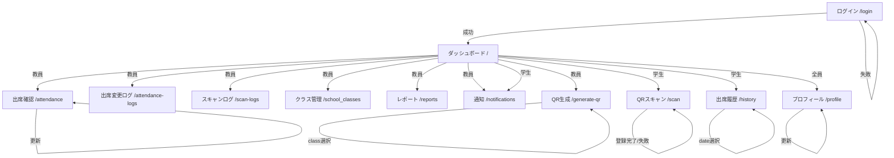
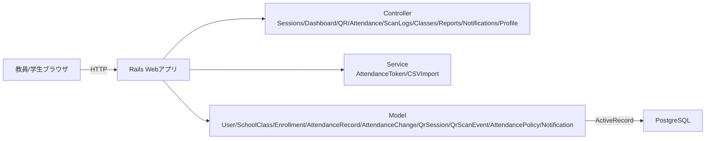
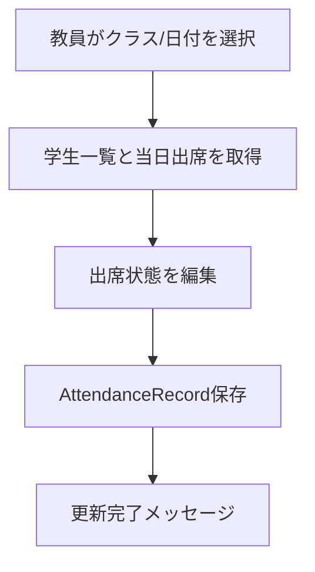
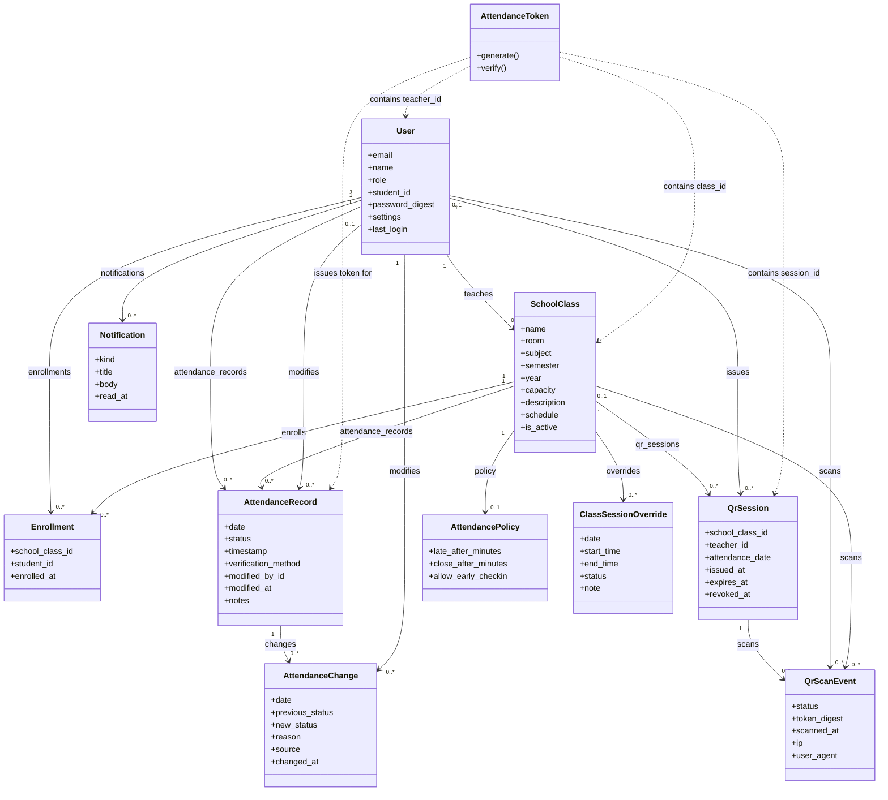

# 学校の出席管理システム 仕様書

本書は現行実装（Rails 8 + Hotwire + PostgreSQL）を参照して作成した仕様書である。

## 1. システム概要
- 目的: 授業単位の出席記録・参照・修正を行う
- 対象ユーザー: 教員、学生
- 認証: セッション + `has_secure_password`
- 出席登録: QRセッション発行 + 署名トークン（MessageVerifier）による学生登録、スキャンログ記録、教員の手動修正
- データ永続化: PostgreSQL
- 主要URL: `/login`, `/`, `/scan`, `/generate-qr`, `/history`, `/attendance`, `/attendance-logs`, `/scan-logs`, `/reports`, `/notifications`, `/school_classes`, `/profile`

## 2. 機能階層図

```mermaid
flowchart TB
  A[出席管理システム]
  A --> B[認証]
  B --> B1[ログイン]
  B --> B2[ログアウト]
  A --> C[ダッシュボード]
  C --> C1[教員: クラス一覧/出席確認/QR生成導線]
  C --> C2[学生: 履修一覧/QRスキャン/履歴導線]
  A --> D[QR出席]
  D --> D1[教員: QRトークン生成]
  D --> D2[学生: QRトークン入力・出席登録]
  A --> E[出席管理]
  E --> E1[学生: 出席履歴参照]
  E --> E2[教員: 出席確認・修正]
  E --> E3[教員: CSVインポート/エクスポート]
  A --> G[監査ログ]
  G --> G1[教員: QRスキャンログ]
  G --> G2[教員: 出席変更ログ]
  A --> H[出席ポリシー]
  H --> H1[教員: 遅刻/締切設定]
  A --> I[クラス管理]
  I --> I1[教員: クラス作成/編集]
  I --> I2[教員: 名簿CSV/履修管理]
  I --> I3[教員: 休講/補講設定]
  A --> J[レポート]
  J --> J1[教員: 出席傾向集計]
  A --> K[通知]
  K --> K1[学生/教員: 更新通知確認]
  A --> F[プロフィール]
  F --> F1[基本情報更新]
  F --> F2[パスワード変更]
```


## 3. IPO図（主要機能）

### 3.1 ログイン
| Input | Process | Output |
|---|---|---|
| email, password | `User.find_by(email)` → `authenticate` → セッション保存 | `/` へ遷移、成功/失敗メッセージ |

### 3.2 QRトークン生成（教員）
| Input | Process | Output |
|---|---|---|
| class_id | 対象クラス取得 → `QrSession` 作成 → `AttendanceToken.generate` | QRコード表示、期限表示、発行セッション保存 |

### 3.3 QRトークン検証・出席登録（学生）
| Input | Process | Output |
|---|---|---|
| token | `AttendanceToken.verify` → `QrSession` 検証(期限/失効/日付) → 履修クラス検証 → 出席レコード作成/更新 → `QrScanEvent` 記録 | `/scan` に結果表示（成功/失敗） |

### 3.4 出席履歴表示（学生）
| Input | Process | Output |
|---|---|---|
| date | `attendance_records` 取得 → `school_class` 参照 | 一覧表示 |

### 3.5 出席確認・修正（教員）
| Input | Process | Output |
|---|---|---|
| class_id, date, attendance[student_id]=status | 学生一覧取得 → レコード作成/更新 → `modified_by` 記録 | 更新完了メッセージ |

### 3.6 プロフィール更新
| Input | Process | Output |
|---|---|---|
| name, email, student_id, password, password_confirmation | `current_user.update` | 成功/失敗メッセージ |

### 3.7 QRスキャンログ（教員）
| Input | Process | Output |
|---|---|---|
| class_id, date, status | `QrScanEvent` を条件検索 → 直近ログ表示 | `/scan-logs` にログ一覧 |

### 3.8 CSVインポート（教員）
| Input | Process | Output |
|---|---|---|
| CSVファイル | CSV解析 → 学生ID/日付/出席状況で更新 | `/attendance` に結果メッセージ |

### 3.9 名簿CSVインポート（教員）
| Input | Process | Output |
|---|---|---|
| CSVファイル | 学生作成/更新 → 履修登録 | `/school_classes/:id` に結果メッセージ |

### 3.10 出席変更ログ（教員）
| Input | Process | Output |
|---|---|---|
| class_id, date, status, source | `AttendanceChange` 検索 → ログ表示 | `/attendance-logs` にログ一覧 |

### 3.11 レポート（教員）
| Input | Process | Output |
|---|---|---|
| start_date, end_date | 出席データ集計 → 指標算出 | `/reports` に集計結果 |

### 3.12 通知
| Input | Process | Output |
|---|---|---|
| - | `Notification` を取得 | `/notifications` に一覧表示 |

## 4. 画面遷移図


## 5. 全体インターフェース図（システム構成）


## 5.1 フローチャート（出席登録: 学生）
```mermaid
flowchart TB
  S1[学生がQRトークン入力] --> S2[AttendanceToken.verify]
  S2 -->|NG| S3[QrScanEvent記録(失敗) → エラー表示]
  S2 -->|OK| S4[QrSession検証(期限/失効/日付)]
  S4 -->|NG| S3
  S4 -->|OK| S5[履修クラス確認]
  S5 -->|未履修| S3
  S5 -->|履修済み| S6[当日出席レコード作成/更新]
  S6 --> S7[QrScanEvent記録(成功) → 出席登録完了メッセージ]
```

## 5.2 フローチャート（出席修正: 教員）


## 6. 全体モジュール分割図

```mermaid
flowchart TB
  A[app/]
  A --> AC[controllers/]
  AC --> AC1[application_controller]
  AC --> AC2[sessions_controller]
  AC --> AC3[dashboard_controller]
  AC --> AC4[qr_scans_controller]
  AC --> AC5[qr_codes_controller]
  AC --> AC6[attendance_history_controller]
  AC --> AC7[class_attendances_controller]
  AC --> AC8[qr_scan_events_controller]
  AC --> AC9[attendance_changes_controller]
  AC --> AC10[school_classes_controller]
  AC --> AC11[enrollments_controller]
  AC --> AC12[class_session_overrides_controller]
  AC --> AC13[reports_controller]
  AC --> AC14[notifications_controller]
  AC --> AC15[profiles_controller]
  A --> AM[models/]
  AM --> AM1[user]
  AM --> AM2[school_class]
  AM --> AM3[enrollment]
  AM --> AM4[attendance_record]
  AM --> AM5[attendance_change]
  AM --> AM6[attendance_policy]
  AM --> AM7[class_session_override]
  AM --> AM8[notification]
  AM --> AM9[qr_session]
  AM --> AM10[qr_scan_event]
  A --> AS[services/]
  AS --> AS1[attendance_token]
  AS --> AS2[attendance_csv_importer]
  AS --> AS3[roster_csv_importer]
```


## 6.1 クラス図


## 7. モジュール仕様書

### 7.1 Controllers

#### ApplicationController
- 役割: 認証必須の制御、`current_user` 提供
- 主要処理: `require_login`, `require_role!`

#### SessionsController
- 役割: ログイン/ログアウト
- 主要処理: `create` で認証、`destroy` でセッション破棄

#### DashboardController
- 役割: ユーザー別ダッシュボード表示
- 主要処理: 教員は `taught_classes`、学生は `enrolled_classes` を表示

#### QrScansController
- 役割: 学生のQR出席登録
- 主要処理: トークン検証、QrSession検証(期限/失効/日付)、履修チェック、当日出席の作成/更新、スキャンログ記録
- 権限: 学生のみ

#### QrCodesController
- 役割: 教員のQRトークン生成
- 主要処理: 対象クラス選択、QrSession作成、トークン生成、期限表示
- 権限: 教員のみ

#### AttendanceHistoryController
- 役割: 学生の出席履歴参照
- 主要処理: 指定日付の出席レコード一覧
- 権限: 学生のみ

#### ClassAttendancesController
- 役割: 教員の出席確認・修正
- 主要処理: 学生一覧と当日レコードの表示、更新、CSV入出力、出席ポリシー更新
- 権限: 教員のみ

#### QrScanEventsController
- 役割: QRスキャン監査ログ
- 主要処理: ログ一覧/フィルタ表示
- 権限: 教員のみ

#### AttendanceChangesController
- 役割: 出席変更ログ
- 主要処理: ログ一覧/CSV出力
- 権限: 教員のみ

#### SchoolClassesController
- 役割: クラス管理
- 主要処理: クラス作成/編集/名簿インポート/詳細表示
- 権限: 教員のみ

#### EnrollmentsController
- 役割: 履修追加/削除
- 主要処理: 学生検索と履修登録
- 権限: 教員のみ

#### ClassSessionOverridesController
- 役割: 休講/補講の特別日程管理
- 主要処理: 追加/削除
- 権限: 教員のみ

#### ReportsController
- 役割: 出席集計レポート
- 主要処理: 期間指定で集計表示
- 権限: 教員のみ

#### NotificationsController
- 役割: 通知一覧
- 主要処理: 一覧表示/既読処理

#### ProfilesController
- 役割: プロフィール表示・更新
- 主要処理: 基本情報とパスワード更新

### 7.2 Models

#### User
- 属性: email, name, role, student_id, password_digest, settings, last_login
- 関連: taught_classes, enrolled_classes, attendance_records, qr_sessions(教員)
- バリデーション: email/name/role 必須、email一意、student_id一意

#### SchoolClass
- 属性: name, teacher_id, room, subject, semester, year, capacity, schedule
- 関連: enrollments, students, attendance_records, qr_sessions, class_session_overrides, attendance_policy
- バリデーション: name/room/subject/semester/year/capacity 必須

#### Enrollment
- 属性: school_class_id, student_id, enrolled_at
- 関連: school_class, student
- バリデーション: クラス内の学生重複禁止

#### AttendanceRecord
- 属性: user_id, school_class_id, date, status, timestamp, verification_method, modified_by_id
- 関連: user, school_class, modified_by
- バリデーション: date/status/verification_method 必須、同日同クラス重複禁止

#### AttendanceChange
- 属性: attendance_record_id, user_id, school_class_id, date, previous_status, new_status, reason, source, changed_at
- 関連: attendance_record, user, school_class, modified_by
- バリデーション: date/new_status/changed_at 必須

#### ClassSessionOverride
- 属性: school_class_id, date, start_time, end_time, status, note
- 関連: school_class
- バリデーション: date 必須、start/end はセットで必須

#### QrSession
- 属性: school_class_id, teacher_id, attendance_date, issued_at, expires_at, revoked_at
- 関連: school_class, teacher
- バリデーション: attendance_date/issued_at/expires_at 必須、expires_at > issued_at

#### QrScanEvent
- 属性: qr_session_id, user_id, school_class_id, status, attendance_status, token_digest, scanned_at, ip, user_agent
- 関連: qr_session, user, school_class
- バリデーション: status/token_digest/scanned_at 必須

#### AttendancePolicy
- 属性: school_class_id, late_after_minutes, close_after_minutes, allow_early_checkin, allowed_ip_ranges, allowed_user_agent_keywords, max_scans_per_minute
- 関連: school_class
- バリデーション: late_after_minutes/close_after_minutes 数値、close_after_minutes >= late_after_minutes

#### Notification
- 属性: user_id, kind, title, body, action_path, read_at
- 関連: user

### 7.3 Services

#### AttendanceToken
- 役割: QRトークン生成/検証
- 主要処理:
  - `generate` で `{class_id, teacher_id, session_id, date, exp}` を署名
  - `verify` で改ざん検知と期限チェック
  - 署名鍵は `QR_TOKEN_SECRET`（未設定時は `secret_key_base` を使用）

#### AttendanceCsvImporter
- 役割: 出席CSVインポート
- 主要処理: 出席状況の作成/更新、変更ログ/通知の作成

#### RosterCsvImporter
- 役割: 名簿CSVインポート
- 主要処理: 学生の作成/更新、履修登録

## 8. 単体テスト仕様書

### 8.1 Models
- User
  - emailを小文字正規化する
  - email/name/role必須
  - email一意制約
  - student_id一意制約（null許可）
- SchoolClass
  - 必須項目未入力で無効
- Enrollment
  - 同一class_id + student_idで重複不可
- AttendanceRecord
  - date/status/verification_method必須
  - 同日同クラス同一ユーザー重複不可
  - status_labelが正しい日本語ラベルを返す
- QrSession
  - attendance_date/issued_at/expires_at必須
  - expires_atがissued_atより後である
- QrScanEvent
  - status/token_digest/scanned_at必須
- AttendancePolicy
  - late_after/close_after が数値
  - close_after_minutes >= late_after_minutes
  - evaluateで遅刻/締切/開始前を判定
- AttendanceChange
  - date/new_status/changed_at必須
- ClassSessionOverride
  - start/endの片方だけは無効

### 8.2 Services
- AttendanceToken
  - generateで期限付きトークンを生成できる
  - verifyで期限内ならok=trueを返す
  - 期限切れならok=falseとエラーメッセージ
  - 改ざんトークンはok=false
  - session_idとattendance_dateを返す
- AttendanceCsvImporter
  - CSVで出席レコードを作成/更新できる
  - 未入力はスキップされる
- RosterCsvImporter
  - 名簿CSVから学生を作成/更新し履修登録できる

### 8.3 Controllers
- SessionsController
  - 正しい認証でログイン成功、`session[:user_id]` 設定
  - 誤った認証でunprocessable_entity
- QrScansController
  - 無効トークンでエラー遷移
  - 履修外クラスはエラー
  - 正常時に当日出席を作成/更新
  - 期限切れ/失効/セッション不一致でエラー
  - 重複スキャンは「すでに出席済み」
- QrCodesController
  - 教員のみアクセス許可
  - クラス未選択時にトークン生成しない
- AttendanceHistoryController
  - 学生のみアクセス許可
  - 不正日付でエラー遷移
- ClassAttendancesController
  - 教員のみアクセス許可
  - 不正日付でエラー遷移
  - 更新でstatus/modified_by/modified_atが保存される
- ProfilesController
  - 更新成功でリダイレクト
  - 不正入力でunprocessable_entity

## 9. 結合テスト仕様書

### 9.1 認証フロー
- 未ログインで`/`アクセス → `/login`へリダイレクト
- ログイン成功 → `/`表示
- ログアウト → `/login`へ

### 9.2 教員フロー
- `/generate-qr`でクラス選択 → QR表示
- `/attendance`でクラス+日付選択 → 学生一覧と出席状態表示
- 出席更新 → 同日レコードが更新される

### 9.3 学生フロー
- `/scan`で有効トークン入力 → 当日出席がpresentで登録（スキャンログも保存）
- `/history`で当日を選択 → 登録済み出席が表示

### 9.4 権限制御
- 教員ページを学生がアクセス → `/`へリダイレクト
- 学生ページを教員がアクセス → `/`へリダイレクト

## 10. 環境変数
- `QR_TOKEN_SECRET`: QRトークン署名用の秘密鍵（変更すると既存トークンは無効）

## 11. 追記: MVP強化(作品展向け)
- QRスキャンはカメラ(BarcodeDetector)に対応し、非対応端末は手入力にフォールバック
- QR生成は `QrSession` を発行し、再生成時に既存セッションを失効
- スキャン結果は `QrScanEvent` に成功/失敗/理由/端末情報を記録
- 教員ダッシュボードに本日の出席サマリーを表示
- 出席管理画面でCSVエクスポートを提供
- `QR_TOKEN_SECRET` を追加(変更時は既存トークン無効)

## 12. 追記: カメラ対応/CSV詳細
- カメラQRスキャンはChromium系(Chrome/Edge/Opera/Samsung Internet)を推奨
- Safari/iOSは未対応の可能性が高いため、手入力フォールバックを利用
- CSVは `start_date`/`end_date` による期間指定が可能
- CSV項目にクラス名/QRセッションID/IP/UserAgent/備考を追加

## 13. 追記: 出席ポリシー/監査ログ/CSVインポート
- 出席ポリシーで遅刻判定/締切/開始前許可を設定
- QRスキャンログを `/scan-logs` で確認可能
- CSVインポートで出席状況を一括反映

## 14. 追記: クラス管理/レポート/通知/リアルタイム
- `/school_classes` でクラス作成・名簿インポート・履修管理
- 休講/補講は特別日程で設定
- `/attendance-logs` で出席変更ログを確認
- `/reports` で期間集計を可視化
- `/notifications` で通知を確認
- QRスキャン結果は出席管理画面にリアルタイム反映
