# RoR出席管理システム (Rails 8 + Hotwire + PostgreSQL)

**QRコードと位置情報で、出席をもっとスマートに**

> メディアフロンティアのプレゼンテーション兼READMEとして、短時間で作品を伝えられる構成にしています。

RoR出席管理システムは、QRコードによる出席登録と位置情報認証を融合させた、学校向けWebアプリケーションです。  
教員・学生・管理者の3ロールで運用し、承認ワークフローと監査ログで実運用に耐える設計を実現しています。


<br>

---

## 目次

| セクション | 内容 |
|:---|:---|
| **概要** | 1分でわかる RoR出席管理システム / 展示ポイント / デモの流れ |
| **プロダクト** | システム概要 / ユーザーロール / OIC運用設定 |
| **技術** | 技術的な特徴 / QR出席の課題と多層防御 / 技術の見せ場 / システム仕様詳細 |
| **設計** | 設計・DB・API・モジュール |
| **品質・運用** | テスト仕様 / 展示チェックリスト / 開発・デプロイ / ライセンス |

<br>

---
---

# PART 1: 概要

---

## 1分でわかる RoR出席管理システム

| 観点 | 内容 |
|:---|:---|
| **体験** | QRスキャンで「出席・退室」を瞬時に記録 |
| **特徴** | 位置情報認証（ジオフェンス）で代返を防止 |
| **強み** | 承認ワークフロー × 監査ログで実運用対応 |
| **価値** | 教員の負担軽減 × 学生の利便性向上 |

<br>

## 展示ポイント（見どころ）

| ポイント | 説明 |
|:---|:---|
| **校内でしか出席できない** | 位置情報（半径50m）による不正防止 |
| **QR高速ローテーション** | 10秒ごとにQR自動更新、スクショ共有を時間的に無効化 |
| **点呼モード** | テーブル形式で対面確認しながらステータス選択（出席/欠席/遅刻/公欠/早退）で登録 |
| **リアルタイム反映** | Hotwireで出席状況が即座に更新 |
| **3ロール運用** | 学生・教員・管理者の権限分離設計 |

<br>

## デモの流れ（展示用）

```
1. 教員ログイン → QRコード発行（10秒ごと自動更新）
       ↓
2. 学生ログイン → QRスキャン → 出席完了
       ↓
3. 出席管理画面でリアルタイム確認
       ↓
4. 点呼モードで対面確認（任意）
       ↓
5. レポート画面で出席率・要注意者を確認
```

<br>

---
---

# PART 2: プロダクト

---

## システム概要

紙の出席簿やICカードに代わる、QRコードベースの出席管理システムです。  
教員がQRコードを発行し、学生がスマートフォンでスキャンするだけで出席登録が完了します。  
2回目のスキャンで退室を記録し、滞在時間から早退判定も自動で行います。

### 主要機能

| 機能 | 内容 |
|:---|:---|
| **QR出席** | 署名付きトークンによる安全な出席登録（10秒ごと自動更新） |
| **点呼モード** | テーブル形式で対面確認、ラジオボタンでステータス選択（出席/欠席/遅刻/公欠/早退）、全員出席一括登録 |
| **位置情報認証** | OIC校内（半径50m）でのみ出席可能 |
| **入室/退室記録** | 2回スキャンで滞在時間・早退を自動判定 |
| **出席申請** | 欠席/遅刻/公欠の申請 → 教員承認ワークフロー |
| **監査ログ** | すべての操作を記録、CSV出力対応 |
| **レポート** | 週次/日次の出席率推移、要注意者抽出、期末PDF/CSV |
| **通知** | Push通知 / メール・LINE通知（未実装） |

<br>

---

## ユーザーロール

3つのロールで権限を分離し、それぞれの責務を明確化しています。

| ロール | 対象 | 主な機能 | 特徴 |
|:---|:---|:---|:---|
| **学生** | 履修者 | QRスキャン、出席履歴、出席申請 | 自分の出席状況を管理 |
| **教員** | 担当教員 | QR発行、点呼モード、出席確認・修正、申請承認、レポート | クラス単位の出席管理 |
| **管理者** | システム管理 | ユーザー管理、権限設定、操作申請承認 | 全体管理と最終承認 |

<br>

---

## OIC運用設定（大阪情報コンピュータ専門学校）

本システムはOIC校内での運用を前提に設定されています。

### 時限設定

| 時限 | 時間 |
|:---|:---|
| 1限 | 09:10 - 10:40 |
| 2限 | 10:50 - 12:20 |
| 3限 | 13:10 - 14:40 |
| 4限 | 14:50 - 16:20 |
| 5限 | 16:30 - 18:00 |

### 位置情報設定

| 項目 | 値 |
|:---|:---|
| 住所 | 大阪府大阪市天王寺区上本町6-8-4 |
| 校内半径 | 50m（ジオフェンス） |
| 精度上限 | 150m |

### 出席ポリシー（デフォルト値）

| 項目 | 値 | 説明 |
|:---|:---|:---|
| 遅刻判定 | 20分 | 授業開始から20分超過で遅刻 |
| 出席締切 | 20分 | 締切後はQRスキャン不可（欠席扱い） |
| 最低出席率 | 80% | 滞在時間がこれを下回ると早退判定 |
| 警告欠席数 | 3回 | 欠席合計がこれ以上で「要注意」 |
| 警告出席率 | 70% | 出席率がこれ未満で「要注意」 |

<br>

---
---

# PART 3: 技術

---

## 技術的な特徴

### Backend (Ruby on Rails 8)

| カテゴリ | 内容 |
|:---|:---|
| **Rails 8 + Hotwire** | Turbo Frame/Streamでリアルタイム更新、画面遷移を最小化 |
| **MVC + Service Object** | Controller/Model/Serviceで責務を分離、保守性を向上 |
| **has_secure_password** | bcryptによるパスワードハッシュ化 |
| **MessageVerifier** | QRトークンの署名・改ざん検知 |
| **PostgreSQL** | JSONB活用、外部キー制約、インデックス最適化 |

### Security & Fraud Detection

| カテゴリ | 内容 |
|:---|:---|
| **QR高速ローテーション** | 10秒ごとにQR自動更新（TTL 30秒）、スクショ共有を時間的に無効化 |
| **点呼モード** | 教員が対面で顔と名前を確認、QR出席済みの学生はスキップ |
| **位置情報認証** | Geolocation API + ジオフェンス判定 |
| **レート制限** | クラス10回/分、学生6回/分のスロットル |
| **不正検知** | 失敗多発/IP集中/トークン共有を検知→教員通知 |
| **IP/ブラウザ制限** | 許可範囲外からのアクセスをブロック |
| **承認ワークフロー** | 出席修正/確定/解除は管理者承認を必須化 |

### QR出席の課題と対策

QR出席は利便性が高い一方、以下のセキュリティ課題が存在する。本システムでは多層防御で対策を講じている。

#### 課題一覧

| 課題 | リスク | 深刻度 |
|:---|:---|:---:|
| **QRスクショ共有** | QR画像を共有し、校内の別の学生が代理スキャン | 高 |
| **GPS偽装** | Spoofingアプリで位置情報を偽装し、遠隔地から出席 | 高 |
| **対面確認の欠如** | 教員が学生の顔を確認する機会がなく、代返を見抜けない | 中 |
| **端末依存** | スマホの充電切れ・カメラ故障時に出席登録不可 | 中 |
| **校内代理スキャン** | 校内にいれば他人のスマホでもスキャン可能 | 中 |

#### 対策マトリクス（実装済み）

| 対策 | 防げる不正 | 仕組み |
|:---|:---|:---|
| **QR高速ローテーション（10秒）** | QRスクショ共有 | 10秒ごとにQRを自動更新（TTL 30秒）。スクショを撮って共有する時間がない |
| **点呼モード** | 対面確認の欠如・端末依存 | 教員が履修者テーブルで顔と名前を確認しながらステータス選択（出席/欠席/遅刻/公欠/早退）。QR出席済みの学生は変更不可。「全員出席」一括ボタン対応 |
| **ジオフェンス（半径50m）** | 遠隔地からの代返 | Geolocation APIで校内在席を検証。精度150m超は拒否 |
| **レート制限** | 連続試行 | クラス10回/分、学生6回/分のスロットル |
| **不正検知** | 組織的代返 | 同一IPからの多数スキャン、トークン共有パターンを検知→教員通知 |
| **IP/ブラウザ制限** | 校外ネットワーク | 許可IP範囲外・許可ブラウザ外をブロック |
| **署名付きトークン** | QR改ざん | MessageVerifierで署名検証、改ざん不可 |
| **監査ログ** | 事後追跡 | 全スキャンをIP・ブラウザ・位置情報付きで記録 |

#### 防御層の構成（多層防御）

```
第1層: トークン署名検証（改ざん防止）
第2層: セッション検証（期限・失効・日付）
第3層: 履修確認（未登録者排除）
第4層: レート制限（連続試行防止）
第5層: IP/ブラウザ制限（ネットワーク制御）
第6層: 位置情報認証（ジオフェンス）
第7層: 不正検知（パターン分析）
第8層: QR高速ローテーション（10秒更新・共有無効化）
第9層: 点呼モード（対面確認・最終防御）
第10層: 監査ログ（事後追跡・抑止力）
```

#### 今後の改善案

| 改善案 | 概要 | 効果 | 実装難度 |
|:---|:---|:---|:---:|
| **顔認証との併用** | スキャン時にカメラで顔を撮影し、登録済み顔写真と照合 | 代理出席を完全に防止 | 高 |
| **Bluetooth近接検証** | 教室にBLEビーコンを設置し、端末の近接を物理的に検証 | GPS偽装を無効化 | 中 |
| **WiFi BSSID検証** | 教室WiFiのアクセスポイント情報を検証し、室内在席を確認 | 精度の高い室内位置証明 | 中 |
| **確認コード** | QR発行時にランダムコードを表示、スキャン後に入力必須で在席証明 | スクショ共有防止 | 低 |
| **デバイスバインディング** | 学生アカウントに端末を1台だけ紐付け | 他人の端末での代理スキャン防止 | 中 |
| **行動スコアリング** | 複数シグナルを組み合わせたリスクスコアで不審行動を検知 | 長期的な不正抑止 | 中 |

<br>

### Frontend (Tailwind + Stimulus)

| カテゴリ | 内容 |
|:---|:---|
| **Tailwind CSS** | ユーティリティファーストでレスポンシブ対応 |
| **Stimulus** | 最小限のJSでインタラクション実装（サイドバースワイプジェスチャー等） |
| **PWA対応** | Service WorkerでPush通知対応、ホーム画面インストール |
| **BarcodeDetector + jsQR** | カメラQRスキャン（フォールバック付き） |

### UI刷新

展示に向けてUIを段階的に刷新しました。機能や画面構成は維持しつつ、見た目と操作性を改善しています。

Google系 → AdminKit風（中間段階） → **SaaSモダンミニマル（現行）**

| 項目 | 初期（Google系） | 現行（SaaSミニマル） |
|:---|:---|:---|
| **テーマ** | Google配色（#4285F4 / #34A853 / #EA4335） | ミュートインディゴ（#5B5BD6）、ニュートラル背景（#FAFAFA） |
| **サイドバー** | ライト背景、緑ハイライト | ダーク背景（#1C1C2E）、インディゴアクセント、幅15rem |
| **トップバー** | 白背景、薄い下線 | フラット白＋下ボーダーのみ、高さ3rem |
| **カード** | 白背景、薄い影、角丸4px | 角丸8px、影なし、hover時borderのみ |
| **KPIカード** | なし（テキスト表示のみ） | 32px角丸アイコン、text-2xl semibold |
| **テーブル** | 横スクロール対応、最小スタイル | ヘッダー透明背景、コンパクトpadding |
| **ボタン** | Google Material風、shadow-google | min-h 36px、角丸6px、影なし（SP時44px維持） |
| **バッジ** | 角丸4px、原色背景＋白文字 | 角丸6px、淡色背景＋濃い文字 |
| **シャドウ** | Google shadow（0 1px 2px + 0 1px 3px） | ほぼ消去（sm: none）、ボーダーで分離 |
| **角丸** | 4px統一 | 4/6/8/10px |
| **フォント** | Roboto / Noto Sans JP | Inter / Noto Sans JP |
| **サイドバー操作** | ハンバーガーボタンのみ | スワイプジェスチャー対応（左スワイプで閉じる、エッジスワイプで開く、ドラッグ追従） |
| **ボトムナビ** | なし（サイドバードロワー式） | フラット白＋上ボーダーのみ |
| **トースト** | 原色背景＋白文字 | ライト背景＋ボーダー＋ダークテキスト |
| **全体印象** | 機能的なGoogle管理画面 | ミニマルSaaS、フラット＋ボーダー、情報密度高め |

> **変更方針**: 日本語の文言（メニュー名、ボタン、ラベル等）は一切変更せず、CSSのみで視覚スタイルを刷新。ビューファイル変更はフォント読み込みとログインロゴ形状の2箇所のみ。モバイル（SP）では44pxタッチターゲットを維持。

<br>

---

## 技術の見せ場（展示で説明するポイント）

| ポイント | 詳細 |
|:---|:---|
| **署名付きQRトークン** | MessageVerifierで改ざん検知、5分で自動失効 |
| **QR高速ローテーション** | 10秒ごとにQR自動更新（TTL 30秒）、スクショ共有を時間的に無効化 |
| **点呼モード** | UNIPA風テーブル形式でステータス選択、QR出席との併用可能 |
| **多層防御（10層）** | トークン署名→位置情報→不正検知→高速ローテーション→点呼の多段階検証 |
| **ジオフェンス認証** | 校内50m判定で代返を物理的に防止 |
| **リアルタイム更新** | Turbo Streamで出席状況が即座に反映 |
| **監査ログ** | 全操作をIP/ブラウザ付きで記録、追跡可能 |

<br>

---

## システム仕様詳細

<br>

### 3-1. システム構成図

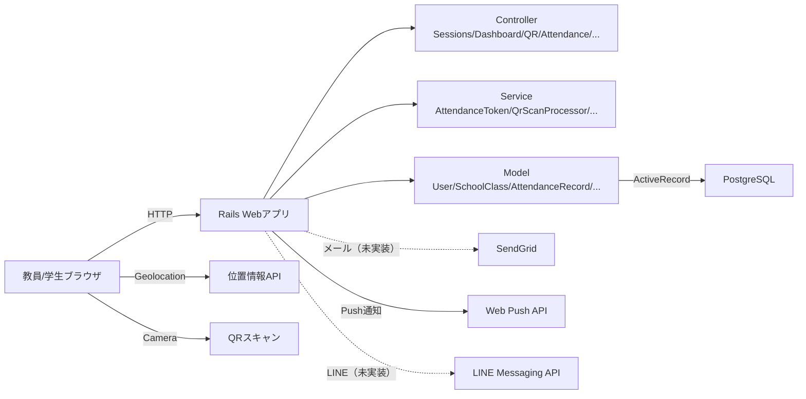

<br>

### 3-2. 機能階層図

```mermaid
graph TD
  A[出席管理システム]
  A --> B[認証]
  B --> B1[ログイン/ログアウト]
  B --> B2[ロックアウト]
  A --> C[ダッシュボード]
  C --> C1[教員：クラス一覧・QR発行導線]
  C --> C2[学生：履修一覧・QRスキャン導線]
  C --> C3[管理者：承認・監査導線]
  A --> D[QR出席]
  D --> D1[教員：QRトークン生成（10秒ローテーション）]
  D --> D2[学生：QRスキャン・出席登録]
  D --> D3[入室/退室記録]
  A --> D2a[点呼モード]
  D2a --> D2a1[教員：履修者テーブル対面確認]
  D2a --> D2a2[ステータス選択登録/全員出席]
  D2a --> D2a3[QR出席済み学生スキップ]
  A --> E[出席管理]
  E --> E1[学生：出席履歴]
  E --> E2[教員：出席確認・修正]
  E --> E3[CSV入出力]
  E --> E4[出席申請・承認]
  E --> E5[出席確定・解除]
  A --> F[監査ログ]
  F --> F1[QRスキャンログ]
  F --> F2[出席変更ログ]
  F --> F3[条件保存・CSV出力]
  A --> G[クラス管理]
  G --> G1[クラス作成・編集]
  G --> G2[履修管理・名簿CSV]
  G --> G3[休講・補講設定]
  A --> H[レポート]
  H --> H1[出席率推移]
  H --> H2[要注意者抽出]
  H --> H3[期末PDF/CSV]
  A --> I[通知]
  I --> I1[Push通知（実装済）]
  I --> I2[メール/LINE（未実装）]
  A --> J[管理者機能]
  J --> J1[ユーザー管理]
  J --> J2[権限管理]
  J --> J3[操作申請承認]
```

<br>

### 3-3. 主要機能の処理フロー (IPO図)

```mermaid
flowchart TB
  subgraph Login[ログイン]
    L_In[Input: email, password]
    L_Proc[Process: User.find_by → authenticate → セッション保存]
    L_Out[Output: ダッシュボードへ遷移 or エラー]
    L_In --> L_Proc --> L_Out
  end

  subgraph QRGen[QRトークン生成]
    QG_In[Input: class_id]
    QG_Proc[Process: QrSession作成 → AttendanceToken.generate（10秒ローテーション）]
    QG_Out[Output: QRコード表示、期限表示]
    QG_In --> QG_Proc --> QG_Out
  end

  subgraph QRScan[QRスキャン・出席登録]
    QS_In[Input: token, latitude, longitude, accuracy]
    QS_Proc[Process: トークン検証 → セッション検証 → 履修確認 → 位置検証 → 出席記録]
    QS_Out[Output: 成功/失敗メッセージ、スキャンログ]
    QS_In --> QS_Proc --> QS_Out
  end

  subgraph RollCall[点呼モード]
    RC_In["Input: class_id, date, attendance{student_id => status}"]
    RC_Proc[Process: クラス選択 → 履修者テーブル表示 → ステータス選択 → 一括登録]
    RC_Out[Output: 各ステータスで出席レコード作成、QR済み学生はスキップ]
    RC_In --> RC_Proc --> RC_Out
  end

  subgraph Report[レポート生成]
    R_In[Input: class_id, start_date, end_date]
    R_Proc[Process: 出席データ集計 → 要注意者抽出]
    R_Out[Output: 集計結果、PDF/CSV]
    R_In --> R_Proc --> R_Out
  end
```

<br>

### 3-4. 画面遷移図

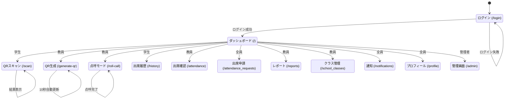

<br>

### 3-5. 要件定義 (マインドマップ)

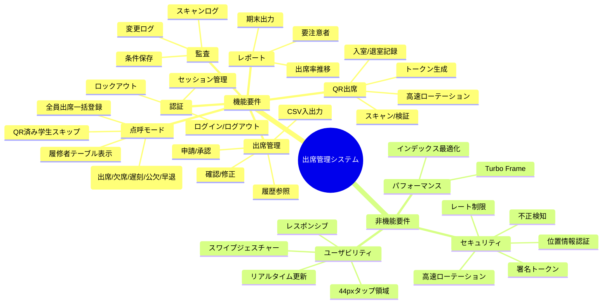

<br>

### 3-6. 出席登録フローチャート

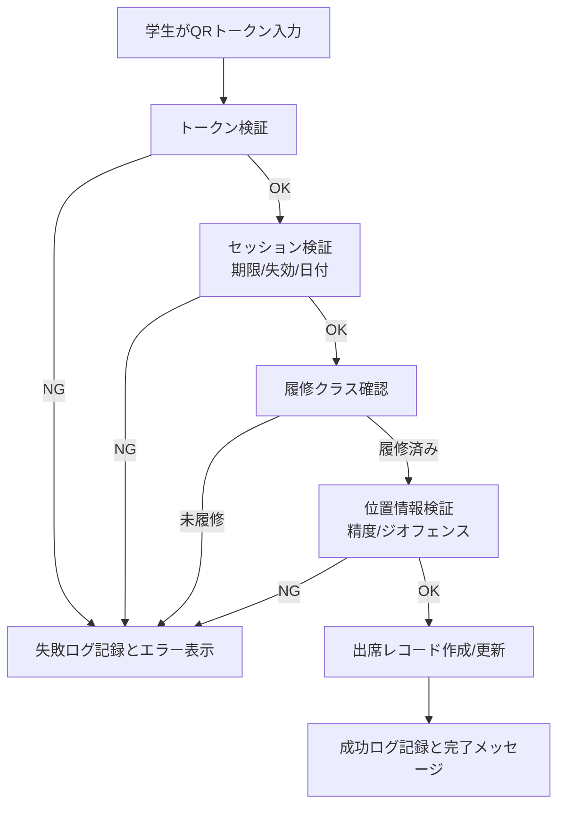

<br>

### 3-7. API仕様（主要URL）

| Method | Path | 概要 | 認証/権限 |
|:---|:---|:---|:---|
| GET/POST | `/login` | ログイン | なし |
| DELETE | `/logout` | ログアウト | ログイン必須 |
| GET | `/` | ダッシュボード | ログイン必須 |
| GET/POST | `/scan` | QRスキャン | 学生のみ |
| GET | `/generate-qr` | QR生成（10秒ローテーション） | 教員/管理者 |
| GET/PATCH | `/roll-call` | 点呼モード | 教員/管理者 |
| GET | `/history` | 出席履歴 | 学生のみ |
| GET/PATCH | `/attendance` | 出席確認・修正 | 教員/管理者 |
| GET/POST | `/attendance_requests` | 出席申請 | 全員 |
| GET | `/reports` | レポート | 教員/管理者 |
| GET | `/scan-logs` | スキャンログ | 教員/管理者 |
| GET | `/attendance-logs` | 変更ログ | 教員/管理者 |
| GET | `/admin` | 管理画面 | 管理者のみ |

<br>

---
---

# PART 4: 設計

---

## データベース設計

### ER図（全テーブル詳細）

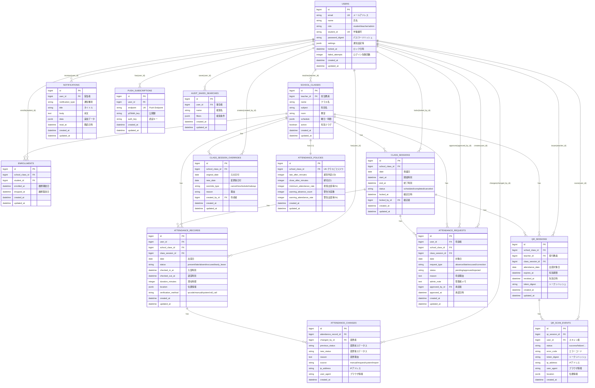

<br>

### 主要テーブル定義

#### users

| カラム | 型 | 説明 |
|:---|:---|:---|
| id | bigint | プライマリキー |
| email | string | メールアドレス（一意） |
| name | string | 氏名 |
| role | string | student/teacher/admin |
| student_id | string | 学籍番号（一意） |
| password_digest | string | パスワードハッシュ |
| settings | jsonb | 通知設定等 |

#### attendance_records

| カラム | 型 | 説明 |
|:---|:---|:---|
| id | bigint | プライマリキー |
| user_id | bigint | FK → users |
| school_class_id | bigint | FK → school_classes |
| class_session_id | bigint | FK → class_sessions |
| date | date | 出席日 |
| status | string | present/late/absent/excused/early_leave |
| checked_in_at | datetime | 入室時刻 |
| checked_out_at | datetime | 退室時刻 |
| duration_minutes | integer | 滞在時間 |
| location | jsonb | 位置情報 |
| verification_method | string | qrcode/manual/system/roll_call |

<br>

---

## モジュール設計

### モジュール分割図

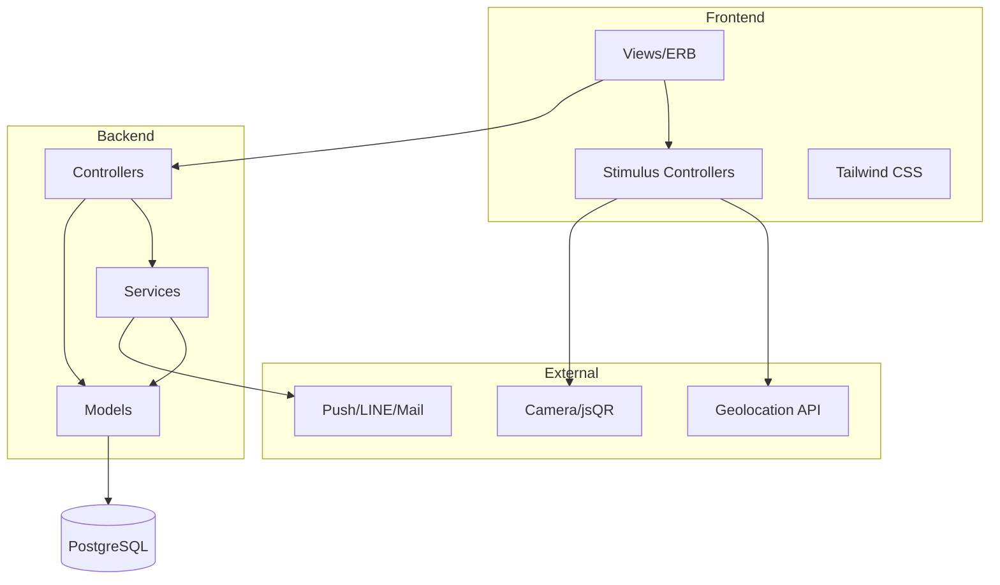

<br>

### 主要モジュールの責務

| モジュール | 責務 | 主なファイル |
|:---|:---|:---|
| Controllers | リクエスト受付、レスポンス返却 | `app/controllers/*` |
| Models | データアクセス、バリデーション | `app/models/*` |
| Services | ビジネスロジック | `app/services/*` |
| Views | HTML生成 | `app/views/*` |
| Stimulus | フロントエンドインタラクション | `app/javascript/controllers/*` |

<br>

### クラス図（Backend - Controller層）

```mermaid
classDiagram
  direction TB

  class ApplicationController {
    +current_user() User
    +logged_in?() bool
    #require_login()
    #require_role!(roles)
    #set_current_user()
    -session_user() User
  }

  class SessionsController {
    +new()
    +create()
    +destroy()
    -login_params()
  }

  class DashboardController {
    +show()
    -load_student_data()
    -load_teacher_data()
    -load_admin_data()
  }

  class QrScansController {
    +new()
    +create()
    -scan_params()
    -process_scan()
  }

  class QrCodesController {
    +show()
    +refresh()
    -generate_qr_image()
  }

  class ClassAttendancesController {
    +show()
    +update()
    +bulk_update()
    +export()
    +import()
    -attendance_params()
  }

  class AttendanceHistoryController {
    +index()
    +show()
    -filter_params()
  }

  class AttendanceRequestsController {
    +index()
    +new()
    +create()
    +approve()
    +reject()
    -request_params()
  }

  class AttendanceChangesController {
    +index()
    +show()
    +export()
    -search_params()
  }

  class ReportsController {
    +index()
    +show()
    +weekly()
    +daily()
    +term()
    +export_pdf()
    +export_csv()
  }

  class SchoolClassesController {
    +index()
    +show()
    +new()
    +create()
    +edit()
    +update()
    +destroy()
    -class_params()
  }

  class EnrollmentsController {
    +index()
    +create()
    +destroy()
    +import()
    +export()
  }

  class ClassSessionOverridesController {
    +new()
    +create()
    +destroy()
    -override_params()
  }

  class ProfilesController {
    +show()
    +edit()
    +update()
    -profile_params()
  }

  class NotificationsController {
    +index()
    +mark_read()
    +mark_all_read()
  }

  class AdminDashboardController {
    +index()
    +users()
    +pending_requests()
    -admin_stats()
  }

  class QrScanEventsController {
    +index()
    +show()
    +export()
  }

  class RollCallsController {
    +show()
    +update()
    -load_students()
  }

  class PushSubscriptionsController {
    +create()
    +destroy()
    +test()
  }

  class LegalController {
    +privacy()
    +terms()
  }

  ApplicationController <|-- SessionsController
  ApplicationController <|-- DashboardController
  ApplicationController <|-- QrScansController
  ApplicationController <|-- QrCodesController
  ApplicationController <|-- ClassAttendancesController
  ApplicationController <|-- AttendanceHistoryController
  ApplicationController <|-- AttendanceRequestsController
  ApplicationController <|-- AttendanceChangesController
  ApplicationController <|-- ReportsController
  ApplicationController <|-- SchoolClassesController
  ApplicationController <|-- EnrollmentsController
  ApplicationController <|-- ClassSessionOverridesController
  ApplicationController <|-- ProfilesController
  ApplicationController <|-- NotificationsController
  ApplicationController <|-- AdminDashboardController
  ApplicationController <|-- QrScanEventsController
  ApplicationController <|-- RollCallsController
  ApplicationController <|-- PushSubscriptionsController
  ApplicationController <|-- LegalController
```

<br>

### クラス図（Backend - Model層）

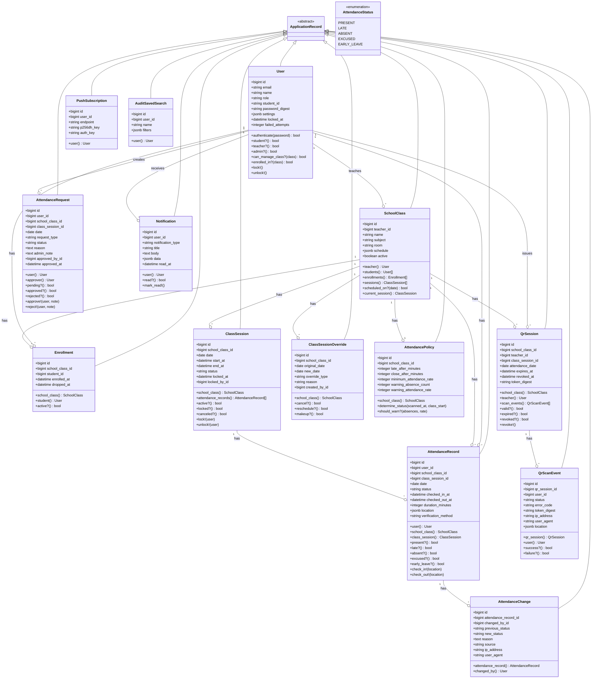

<br>

### クラス図（Backend - Service層）

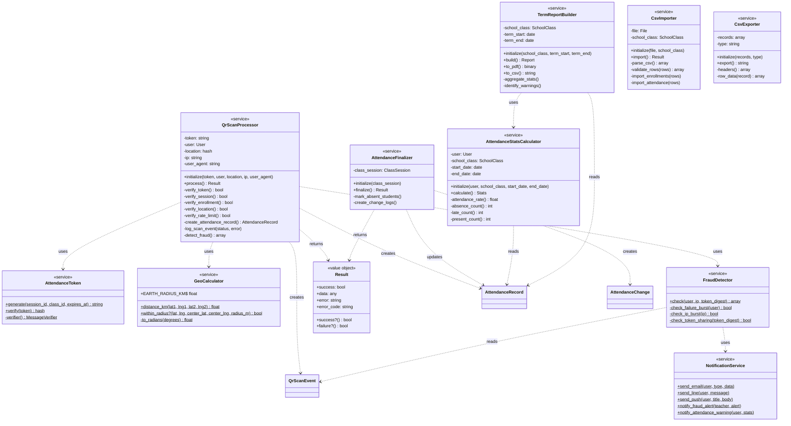

<br>

---

## 設計方針

### 前提

| 対象 | 方針 |
|:---|:---|
| 認証 | セッションベース、has_secure_password |
| 認可 | ロール + 権限テーブルで機能単位制御 |
| データ | PostgreSQL、外部キー制約、インデックス最適化 |
| UI | Hotwire (Turbo + Stimulus)、画面遷移を最小化 |

### レイヤー定義

| レイヤー | 内容 |
|:---|:---|
| View層 | ERBテンプレート、Turbo Frame/Stream |
| Controller層 | リクエスト/レスポンス、権限チェック |
| Service層 | ビジネスロジック（トークン生成、スキャン処理等） |
| Model層 | データアクセス、バリデーション、関連定義 |
| Infrastructure | PostgreSQL、メール/Push/LINE配信 |

<br>

### データフロー（QRスキャン）

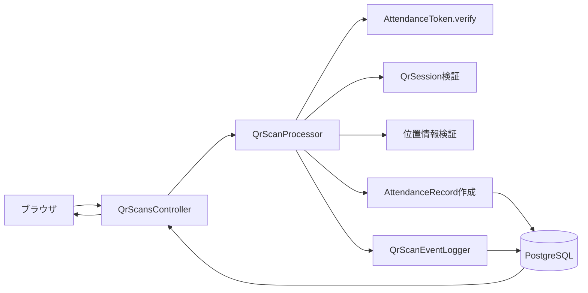

<br>

### 非機能設計

| 観点 | 内容 |
|:---|:---|
| 性能 | Turbo Frameで部分更新、N+1防止、インデックス最適化 |
| 信頼性 | トランザクション、外部キー制約、バリデーション |
| セキュリティ | 署名トークン、位置情報認証、レート制限、監査ログ |
| 運用 | IP/ブラウザ記録でログ追跡可能 |

<br>

---

## クラス設計一覧

| クラス/モジュール | 役割 | 主な責務 |
|:---|:---|:---|
| User | ユーザー | 認証、ロール判定、設定管理 |
| SchoolClass | クラス | スケジュール、履修者管理 |
| AttendanceRecord | 出席記録 | ステータス管理、入退室時刻 |
| AttendanceRequest | 出席申請 | 申請/承認ワークフロー |
| ClassSession | 授業回 | 日程、確定/解除状態 |
| QrSession | QRセッション | 発行/失効管理 |
| QrScanEvent | スキャンログ | 成功/失敗記録 |
| AttendanceChange | 変更ログ | 変更履歴、理由記録 |
| AttendancePolicy | 出席ポリシー | 遅刻/締切/警告の閾値 |
| AttendanceToken | トークン生成/検証 | 署名付きQRトークン |
| QrScanProcessor | スキャン処理 | 検証→記録の統括 |
| RollCallsController | 点呼モード | テーブル形式でステータス選択、一括出席登録 |
| AttendanceFinalizer | 自動確定 | 締切後の欠席確定 |
| TermReportBuilder | レポート生成 | 期末集計 |

<br>

---

## ディレクトリ構成

```
app/
├── controllers/          # Controller層
│   ├── application_controller.rb
│   ├── sessions_controller.rb
│   ├── qr_scans_controller.rb
│   ├── qr_codes_controller.rb
│   ├── class_attendances_controller.rb
│   ├── roll_calls_controller.rb
│   └── admin/
│
├── models/               # Model層
│   ├── user.rb
│   ├── school_class.rb
│   ├── attendance_record.rb
│   ├── attendance_policy.rb
│   └── ...
│
├── services/             # Service層
│   ├── attendance_token.rb
│   ├── qr_scan_processor.rb
│   ├── attendance_finalizer.rb
│   └── ...
│
├── views/                # View層
│   ├── layouts/
│   ├── sessions/
│   ├── dashboard/
│   └── ...
│
└── javascript/           # Stimulus Controllers
    └── controllers/
```

<br>

---
---

# PART 5: 品質・運用

---

## テスト仕様

### 単体テスト

| ID | 対象 | 条件/入力 | 期待結果 |
|:---:|:---|:---|:---|
| 01 | AttendancePolicy | 授業開始10分後にスキャン | `present` と判定される |
| 02 | AttendancePolicy | 授業開始25分後にスキャン | `late` と判定される |
| 03 | AttendancePolicy | 締切後にスキャン | `outside_window` で拒否 |
| 04 | AttendancePolicy | 滞在時間が80%未満 | `early_leave` と判定される |
| 05 | AttendanceToken | 有効なトークンを検証 | `ok: true` と各IDが返る |
| 06 | AttendanceToken | 期限切れトークン | `status: expired` が返る |
| 07 | AttendanceToken | 改ざんトークン | `status: invalid` が返る |
| 08 | QrScanProcessor | 未履修クラスのQR | `not_enrolled` で拒否 |
| 09 | QrScanProcessor | 休講日のQR | `class_canceled` で拒否 |

<br>

### 結合テスト

| ID | シーン | 手順 | 期待結果 |
|:---:|:---|:---|:---|
| 01 | ログイン成功 | 正しい認証情報を入力 | ダッシュボードへ遷移 |
| 02 | ログイン失敗 | 誤った認証情報を入力 | エラーメッセージ表示 |
| 03 | QR生成 | 教員がクラスを選択 | QRコードが表示される |
| 04 | QRスキャン成功 | 学生が有効なQRをスキャン | 「出席を記録しました」表示 |
| 05 | 退室記録 | 同一授業で2回目スキャン | 「退室を記録しました」表示 |
| 06 | 出席申請 | 学生が理由を入力して送信 | 申請が登録される |
| 07 | 申請承認 | 教員が承認ボタンを押す | 出席記録に反映される |
| 08 | 出席確定 | 教員が確定を実行 | 管理者承認待ちになる |
| 09 | 権限エラー | 学生が教員ページにアクセス | リダイレクトされる |
| 10 | 点呼モード | 教員がクラス選択→学生リスト表示 | 履修者一覧が表示される |
| 11 | 点呼出席登録 | 教員がステータスを選択して「点呼を完了」 | verification_method=roll_call で各ステータス登録 |
| 12 | 点呼QR済みスキップ | QR出席済みの学生を点呼で登録 | QR出席が上書きされない |

<br>

---

## 展示チェックリスト

| カテゴリ | 確認項目 |
|:---|:---|
| **機材** | PC、スマートフォン、安定した回線 |
| **環境** | ローカルサーバー起動、DB接続確認 |
| **動作確認** | ログイン、QR生成/スキャン、レポート表示 |
| **説明順** | 1分概要 → デモ → 技術の見せ場 → 設計図 |

<br>

---

## 開発・デプロイ

### 必須要件

| 項目 | バージョン/詳細 |
|:---|:---|
| Ruby | 3.3+ |
| Rails | 8.0+ |
| PostgreSQL | 16+ |
| Node.js | 20+ |

### セットアップ

```bash
# 1. 依存関係のインストール
bundle install

# 2. データベースセットアップ
bin/rails db:setup

# 3. 開発サーバー起動
bin/rails server

# 4. 本番デプロイ（Render）
bin/render-build.sh
```

### 初期ログイン

| ロール | メールアドレス | パスワード |
|:---|:---|:---|
| 管理者 | admin@example.com | password |
| 教員 | teacher@example.com | password |
| 学生 | student@example.com | password |

### 環境変数

| 変数名 | 用途 |
|:---|:---|
| DATABASE_URL | DB接続URL |
| RAILS_MASTER_KEY | Rails暗号化キー |
| QR_TOKEN_SECRET | QRトークン署名用 |
| SENDGRID_API_KEY | メール送信（未実装） |
| LINE_CHANNEL_ACCESS_TOKEN | LINE通知（未実装） |
| WEBPUSH_PUBLIC_KEY | Push通知公開鍵（VAPID） |
| WEBPUSH_PRIVATE_KEY | Push通知秘密鍵（VAPID） |
| WEBPUSH_SUBJECT | Push通知送信元（mailto:） |

<br>

---

## ライセンス & クレジット

| 項目 | 内容 |
|:---|:---|
| **License** | MIT |
| **Framework** | Ruby on Rails 8 |
| **UI** | Tailwind CSS |
| **QR生成** | RQRCode |
| **PDF生成** | Prawn |
| **Push通知** | web-push gem (v3) |

