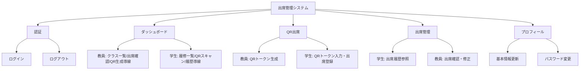
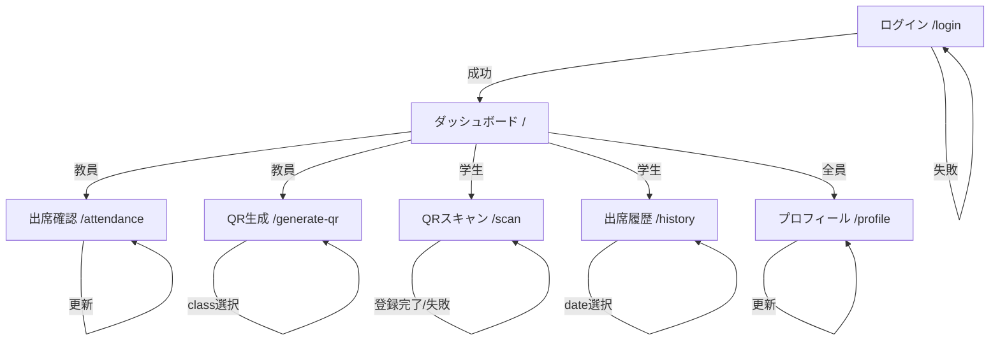
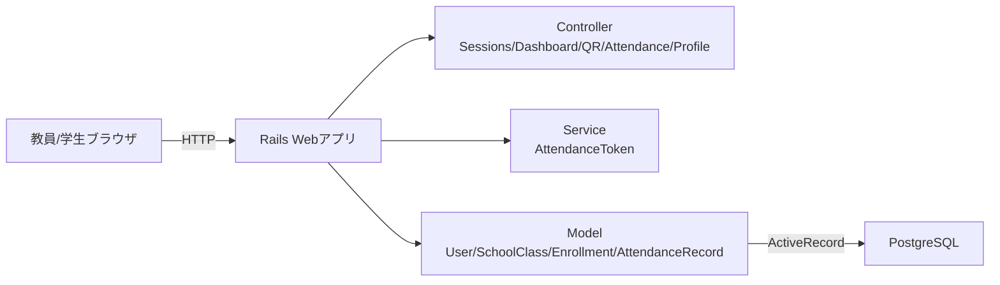
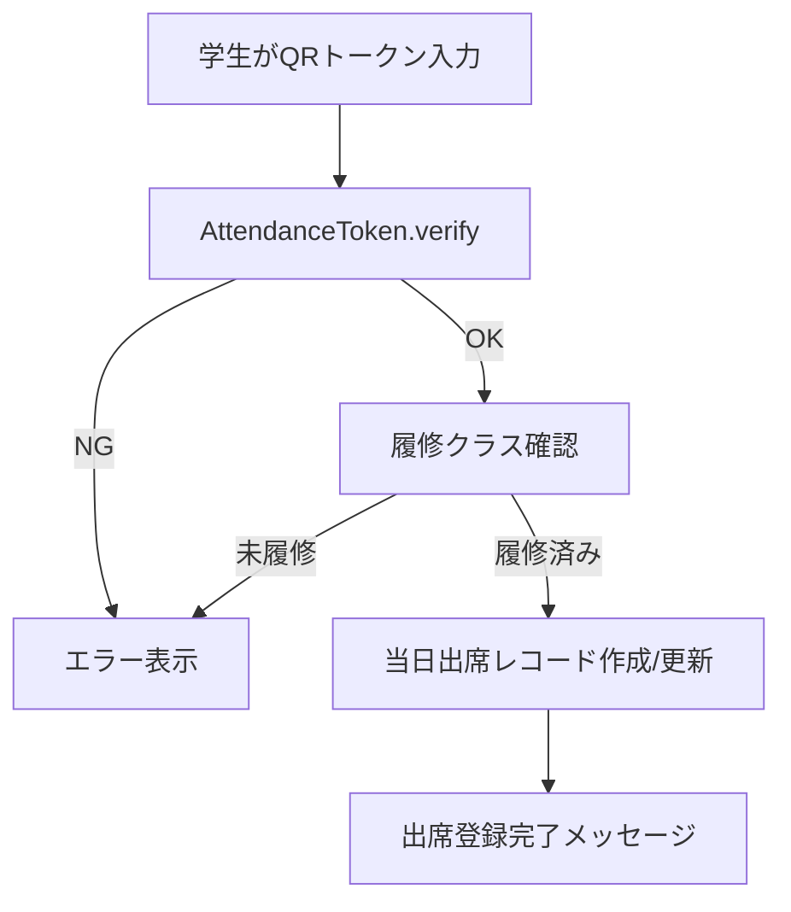
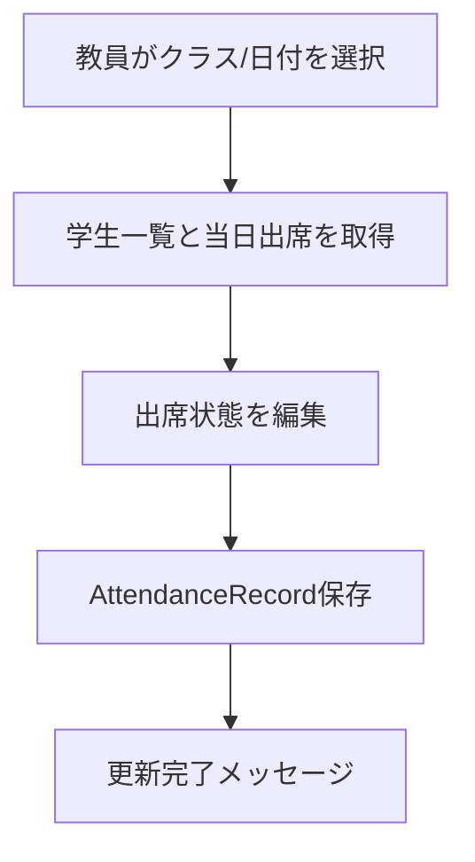
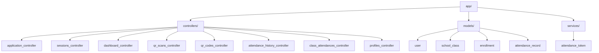
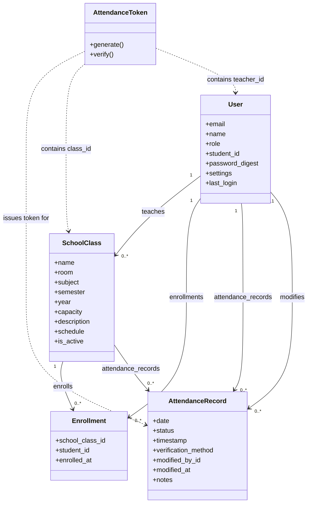

# 学校の出席管理システム 仕様書

本書は `c:\Users\cafec\OneDrive\Desktop\tables勉強用\school` の現行実装（Rails 8 + Hotwire + PostgreSQL）を参照して作成した仕様書である。

## 1. システム概要
- 目的: 授業単位の出席記録・参照・修正を行う
- 対象ユーザー: 教員、学生
- 認証: セッション + `has_secure_password`
- 出席登録: QRトークン（MessageVerifier）による学生登録、教員の手動修正
- データ永続化: PostgreSQL
- 主要URL: `/login`, `/`, `/scan`, `/generate-qr`, `/history`, `/attendance`, `/profile`

## 2. 機能階層図

## 3. IPO図（主要機能）

### 3.1 ログイン
| Input | Process | Output |
|---|---|---|
| email, password | `User.find_by(email)` → `authenticate` → セッション保存 | `/` へ遷移、成功/失敗メッセージ |

### 3.2 QRトークン生成（教員）
| Input | Process | Output |
|---|---|---|
| class_id | 対象クラス取得 → `AttendanceToken.generate` | QRコード表示、期限表示 |

### 3.3 QRトークン検証・出席登録（学生）
| Input | Process | Output |
|---|---|---|
| token | `AttendanceToken.verify` → 履修クラス検証 → 出席レコード作成/更新 | `/scan` に結果表示（成功/失敗） |

### 3.4 出席履歴表示（学生）
| Input | Process | Output |
|---|---|---|
| date | `attendance_records` 取得 → `school_class` 参照 | 一覧表示 |

### 3.5 出席確認・修正（教員）
| Input | Process | Output |
|---|---|---|
| class_id, date, attendance[student_id]=status | 学生一覧取得 → レコード作成/更新 → `modified_by` 記録 | 更新完了メッセージ |

### 3.6 プロフィール更新
| Input | Process | Output |
|---|---|---|
| name, email, student_id, password, password_confirmation | `current_user.update` | 成功/失敗メッセージ |

## 4. 画面遷移図

## 5. 全体インターフェース図（システム構成）

## 5.1 フローチャート（出席登録: 学生）

## 5.2 フローチャート（出席修正: 教員）

## 6. 全体モジュール分割図

## 6.1 クラス図

## 7. モジュール仕様書

### 7.1 Controllers

#### ApplicationController
- 役割: 認証必須の制御、`current_user` 提供
- 主要処理: `require_login`, `require_role!`

#### SessionsController
- 役割: ログイン/ログアウト
- 主要処理: `create` で認証、`destroy` でセッション破棄

#### DashboardController
- 役割: ユーザー別ダッシュボード表示
- 主要処理: 教員は `taught_classes`、学生は `enrolled_classes` を表示

#### QrScansController
- 役割: 学生のQR出席登録
- 主要処理: トークン検証、履修チェック、当日出席の作成/更新
- 権限: 学生のみ

#### QrCodesController
- 役割: 教員のQRトークン生成
- 主要処理: 対象クラス選択、トークン生成、期限表示
- 権限: 教員のみ

#### AttendanceHistoryController
- 役割: 学生の出席履歴参照
- 主要処理: 指定日付の出席レコード一覧
- 権限: 学生のみ

#### ClassAttendancesController
- 役割: 教員の出席確認・修正
- 主要処理: 学生一覧と当日レコードの表示、更新
- 権限: 教員のみ

#### ProfilesController
- 役割: プロフィール表示・更新
- 主要処理: 基本情報とパスワード更新

### 7.2 Models

#### User
- 属性: email, name, role, student_id, password_digest, settings, last_login
- 関連: taught_classes, enrolled_classes, attendance_records
- バリデーション: email/name/role 必須、email一意、student_id一意

#### SchoolClass
- 属性: name, teacher_id, room, subject, semester, year, capacity, schedule
- 関連: enrollments, students, attendance_records
- バリデーション: name/room/subject/semester/year/capacity 必須

#### Enrollment
- 属性: school_class_id, student_id, enrolled_at
- 関連: school_class, student
- バリデーション: クラス内の学生重複禁止

#### AttendanceRecord
- 属性: user_id, school_class_id, date, status, timestamp, verification_method, modified_by_id
- 関連: user, school_class, modified_by
- バリデーション: date/status/verification_method 必須、同日同クラス重複禁止

### 7.3 Services

#### AttendanceToken
- 役割: QRトークン生成/検証
- 主要処理:
  - `generate` で `{class_id, teacher_id, exp}` を署名
  - `verify` で改ざん検知と期限チェック

## 8. 単体テスト仕様書

### 8.1 Models
- User
  - emailを小文字正規化する
  - email/name/role必須
  - email一意制約
  - student_id一意制約（null許可）
- SchoolClass
  - 必須項目未入力で無効
- Enrollment
  - 同一class_id + student_idで重複不可
- AttendanceRecord
  - date/status/verification_method必須
  - 同日同クラス同一ユーザー重複不可
  - status_labelが正しい日本語ラベルを返す

### 8.2 Services
- AttendanceToken
  - generateで期限付きトークンを生成できる
  - verifyで期限内ならok=trueを返す
  - 期限切れならok=falseとエラーメッセージ
  - 改ざんトークンはok=false

### 8.3 Controllers
- SessionsController
  - 正しい認証でログイン成功、`session[:user_id]` 設定
  - 誤った認証でunprocessable_entity
- QrScansController
  - 無効トークンでエラー遷移
  - 履修外クラスはエラー
  - 正常時に当日出席を作成/更新
- QrCodesController
  - 教員のみアクセス許可
  - クラス未選択時にトークン生成しない
- AttendanceHistoryController
  - 学生のみアクセス許可
  - 不正日付でエラー遷移
- ClassAttendancesController
  - 教員のみアクセス許可
  - 不正日付でエラー遷移
  - 更新でstatus/modified_by/modified_atが保存される
- ProfilesController
  - 更新成功でリダイレクト
  - 不正入力でunprocessable_entity

## 9. 結合テスト仕様書

### 9.1 認証フロー
- 未ログインで`/`アクセス → `/login`へリダイレクト
- ログイン成功 → `/`表示
- ログアウト → `/login`へ

### 9.2 教員フロー
- `/generate-qr`でクラス選択 → QR表示
- `/attendance`でクラス+日付選択 → 学生一覧と出席状態表示
- 出席更新 → 同日レコードが更新される

### 9.3 学生フロー
- `/scan`で有効トークン入力 → 当日出席がpresentで登録
- `/history`で当日を選択 → 登録済み出席が表示

### 9.4 権限制御
- 教員ページを学生がアクセス → `/`へリダイレクト
- 学生ページを教員がアクセス → `/`へリダイレクト
