# 学校の出席管理システム 仕様書

本書は現行実装（Rails 8 + Hotwire + PostgreSQL）を参照して作成した仕様書である。

## 1. システム概要
- 目的: 授業単位の出席記録・参照・修正を行う
- 対象ユーザー: 教員、学生、管理者
- 管理者: 教員機能の全権 + 出席確定解除/強制修正の実行
- 権限: ロール/権限テーブルで機能単位の権限制御
- 認証: セッション + `has_secure_password`
- 出席登録: QRセッション発行 + 署名トークン（MessageVerifier）による入室/退室登録、早退判定、スキャンログ記録、教員の手動修正
- 位置情報: QRスキャン時に位置情報を取得し、精度/ジオフェンス判定で不正を抑止
- 出席申請: 学生の欠席/遅刻/公欠申請と教員の承認/却下
- 操作申請: 出席修正/確定/解除/CSV反映は承認フロー経由で実行
- データ永続化: PostgreSQL
- 主要URL: `/login`, `/`, `/scan`, `/generate-qr`, `/history`, `/attendance`, `/attendance_requests`, `/attendance-logs`, `/scan-logs`, `/reports`, `/notifications`, `/school_classes`, `/profile`, `/admin`, `/admin/users`, `/admin/roles`, `/admin/operation_requests`, `/terms`, `/privacy`, `/data-policy`

### 1.0 共通UI/UXルール
- ボタンは短い動詞（ログイン/保存/戻る）で統一し、成功/警告/エラーは色＋短文理由で表現（緑/黄/赤）。
- モバイルは44px以上のタップ領域と16px入力フォントを徹底し、横スクロールを抑止する。
- 編集・作成・承認のフォームはドロワー＋Turbo Frameで遷移を減らし、完了後は一覧を即時置換する。
- 操作結果はトースト（固定表示＋自動消滅）に統一し、Turbo Streamでフラッシュ領域を即時更新する。
- ログ詳細（出席変更/スキャン）は行クリックで詳細フレームに表示し、画面遷移を最小化する。
- フィルタ系（出席/申請/ログ）は「前回条件」復元リンクを用意し、CSV/PDFダウンロードはTurbo無効化で確実に取得する。

### 1.1 学校運用設定（大阪情報コンピュータ専門学校）
- 学期: 前期 / 後期
- 時限:
  - 1限 09:10-10:40
  - 2限 10:50-12:20
  - 3限 13:10-14:40
  - 4限 14:50-16:20
  - 5限 16:30-18:00
- 教室:
  - 2C教室
  - 3A教室 / 3B教室 / 3C教室
  - 4A教室 / 4B教室 / 4C教室 / 4D教室
  - 5A教室 / 5B教室 / 5C教室 / 5D教室
  - 6A教室 / 6B教室 / 6C教室 / 6D教室
  - 7A教室 / 7B教室 / 7C教室 / 7D教室
  - 8A教室 / 8B教室 / 8C教室 / 8D教室
  - 9D-1教室 / 9D-2教室
- 位置情報（校内限定）:
  - 郵便番号: 543-0001
  - 住所: 大阪府大阪市天王寺区上本町6-8-4
  - 校内半径: 50m
- 出席判定:
  - 教員が出席QRを発行して学生がスキャンした記録は出席
  - 授業開始20分以降は欠席

### 1.2 出席ポリシーのボーダーライン（デフォルト値）
- 遅刻判定: 授業開始 + 20分（`late_after_minutes`）
  - 現行UIは遅刻/締切を固定値として扱う
  - QRスキャンは「出席扱い」、20分超過は登録不可（欠席扱い）
  - 遅刻ステータスは申請承認/手動修正/CSVで付与
- 出席締切: 授業開始 + 20分（`close_after_minutes`）
  - 締切を過ぎるとQRスキャンは`outside_window`で拒否
  - 自動欠席確定も同じ締切を基準に実行
- 早退判定: 滞在時間が必要分数を下回る場合に「早退」
  - 必要分数 = 授業分数 × 最低出席率（`minimum_attendance_rate`）/ 100 を切り上げ
  - 既定値: 80%
- 注意アラート（要注意）: 次のいずれかで対象学生を抽出
  - 欠席合計（欠席 + 早退 + 未入力） >= 3（`warning_absent_count`）
  - 出席率 < 70%（`warning_rate_percent`）
  - 出席率の計算: (出席 + 遅刻 + 公欠) / 予定回数 × 100
- 位置情報（QRスキャン時）:
  - 位置情報取得の必須化: `require_location`（OIC校内運用のため固定）
  - 位置情報精度の上限: `geo_accuracy_max_m`（m、既定150）
  - ジオフェンス: OIC校内に固定（`geo_center_lat` / `geo_center_lng` + `geo_radius_m=50`）
  - 教室住所: `geo_postal_code` / `geo_address` はOIC固定（管理画面で変更不可）
- レート制限（QRスキャン）:
  - クラス単位: 1分あたり10回（`max_scans_per_minute`）
  - 学生単位: 1分あたり6回（`student_max_scans_per_minute`）
- 不正検知しきい値（QRログ監視）:
  - 失敗多発: 2分内に4回以上（`fraud_failure_threshold`）
  - 同一IP集中: 1分内に8回以上（`fraud_ip_burst_threshold`）
  - トークン共有: 2分内に2人以上（`fraud_token_share_threshold`）
  - IP/ブラウザブロックは即時通知

## 2. 機能階層図

## 3. IPO図（主要機能）

### 3.1 ログイン
| Input | Process | Output |
|---|---|---|
| email, password | `User.find_by(email)` → `authenticate` → セッション保存 | `/` へ遷移、成功/失敗メッセージ |
- セキュリティ: 失敗回数が一定数を超えると一定時間ログインをロックする。

### 3.2 QRトークン生成（教員）
| Input | Process | Output |
|---|---|---|
| class_id | 対象クラス取得 → `QrSession` 作成 → `AttendanceToken.generate` | QRコード表示、期限表示、発行セッション保存 |

### 3.3 QRトークン検証・出席登録（学生）
| Input | Process | Output |
|---|---|---|
| token, latitude, longitude, accuracy | `AttendanceToken.verify` → `QrSession` 検証(期限/失効/日付) → 履修クラス検証 → 位置情報検証(精度/ジオフェンス) → 入室/退室の出席レコード作成/更新(位置情報を保存) → `QrScanEvent` 記録 | `/scan` に結果表示（成功/失敗） |

### 3.4 出席履歴表示（学生）
| Input | Process | Output |
|---|---|---|
| date | `attendance_records` 取得 → `school_class` 参照 | 一覧表示 |

### 3.5 出席確認・修正（教員）
| Input | Process | Output |
|---|---|---|
| class_id, date, attendance[student_id]=status | 学生一覧取得 → 教員は操作申請、管理者は即時更新 → `modified_by` 記録 | 更新/申請完了メッセージ |

### 3.6 プロフィール更新
| Input | Process | Output |
|---|---|---|
| name, email, student_id, password, password_confirmation | `current_user.update` | 成功/失敗メッセージ |

### 3.7 QRスキャンログ（教員）
| Input | Process | Output |
|---|---|---|
| class_id, date, status | `QrScanEvent` を条件検索 → 直近ログ表示 | `/scan-logs` にログ一覧 |

### 3.8 CSVインポート（教員）
| Input | Process | Output |
|---|---|---|
| CSVファイル | CSV解析 → 教員は操作申請、管理者は即時反映 | `/attendance` に結果メッセージ |

### 3.9 名簿CSVインポート（教員/管理者）
| Input | Process | Output |
|---|---|---|
| CSVファイル | 管理者は学生を新規作成/更新、教員は既存学生の更新 → 履修登録 | `/school_classes/:id` に結果メッセージ |

### 3.10 出席変更ログ（教員）
| Input | Process | Output |
|---|---|---|
| class_id, date, status, source | `AttendanceChange` 検索 → ログ表示 | `/attendance-logs` にログ一覧 |

### 3.11 レポート（教員）
| Input | Process | Output |
|---|---|---|
| start_date, end_date | 出席データ集計 → 指標算出 | `/reports` に集計結果 |

### 3.12 通知
| Input | Process | Output |
|---|---|---|
| - | `Notification` を取得 | `/notifications` に一覧表示 |
- 通知作成時にメール/LINE/Pushへ自動配信（ユーザー設定と連携が有効な場合）
- LINEはプロフィールでユーザーIDを登録、Pushはブラウザで購読登録する

### 3.13 出席申請
| Input | Process | Output |
|---|---|---|
| class_id, date, request_type, reason | `AttendanceRequest` 作成 → 教員へ通知 | `/attendance_requests` に結果表示 |

## 4. 画面遷移図

## 5. 全体インターフェース図（システム構成）

## 5.1 フローチャート（出席登録: 学生）

## 5.2 フローチャート（出席修正: 教員）

## 6. 全体モジュール分割図

## 6.1 クラス図

```mermaid
classDiagram
  class User {
    +email
    +name
    +role
    +student_id
    +password_digest
    +settings
    +last_login
  }
  class SchoolClass {
    +name
    +room
    +subject
    +semester
    +year
    +capacity
    +description
    +schedule
    +is_active
  }
  class Enrollment {
    +school_class_id
    +student_id
    +enrolled_at
  }
  class AttendanceRecord {
    +date
    +status
    +timestamp
    +checked_in_at
    +checked_out_at
    +duration_minutes
    +verification_method
    +modified_by_id
    +modified_at
    +notes
  }
  class AttendanceRequest {
    +date
    +request_type
    +status
    +reason
    +submitted_at
  }
  class ClassSession {
    +date
    +start_at
    +end_at
    +status
    +locked_at
  }
  class QrSession {
    +school_class_id
    +teacher_id
    +attendance_date
    +issued_at
    +expires_at
    +revoked_at
  }
  class QrScanEvent {
    +status
    +token_digest
    +attendance_status
    +scanned_at
    +ip
    +user_agent
  }
  class AttendancePolicy {
    +late_after_minutes
    +close_after_minutes
    +allow_early_checkin
    +allowed_ip_ranges
    +allowed_user_agent_keywords
    +max_scans_per_minute
    +minimum_attendance_rate
    +warning_absent_count
    +warning_rate_percent
  }
  class AttendancePolicyTiming {
    +late_after_minutes
    +close_after_minutes
  }
  class AttendancePolicyAttendanceRate {
    +minimum_attendance_rate
  }
  class AttendancePolicyWarnings {
    +warning_absent_count
    +warning_rate_percent
  }
  class AttendancePolicyAccess {
    +allowed_ip_ranges
    +allowed_user_agent_keywords
  }
  class AttendancePolicyRateLimit {
    +max_scans_per_minute
    +student_max_scans_per_minute
  }
  class AttendancePolicyFraud {
    +fraud_failure_threshold
    +fraud_ip_burst_threshold
    +fraud_token_share_threshold
  }
  class AttendanceStatus {
    +label
    +badge_class
    +normalize
  }
  class AttendanceChange {
    +date
    +previous_status
    +new_status
    +reason
    +source
    +ip
    +user_agent
    +changed_at
  }
  class ClassSessionOverride {
    +date
    +start_time
    +end_time
    +status
    +note
  }
  class Notification {
    +kind
    +title
    +body
    +read_at
  }
  class Role {
    +name
    +label
    +description
  }
  class Permission {
    +key
    +label
  }
  class RolePermission {
    +role_id
    +permission_id
  }
  class OperationRequest {
    +request_type
    +status
    +payload
    +decided_at
  }
  class AuditSavedSearch {
    +name
    +filters
    +is_default
  }
  class AttendanceToken {
    +generate()
    +verify()
  }
  class QrScanProcessor {
    +process
  }
  class QrScanRateLimiter {
    +allow
  }
  class QrScanEventLogger {
    +log_success
    +log_failure
  }
  class OperationRequestProcessor {
    +approve
  }
  class OperationRequestAttendanceCorrection
  class OperationRequestAttendanceFinalize
  class OperationRequestAttendanceUnlock
  class OperationRequestAttendanceCsvImport

  User "1" --> "0..*" SchoolClass : teaches
  User "1" --> "0..*" Enrollment : enrollments
  SchoolClass "1" --> "0..*" Enrollment : enrolls
  User "1" --> "0..*" AttendanceRecord : attendance_records
  SchoolClass "1" --> "0..*" AttendanceRecord : attendance_records
  SchoolClass "1" --> "0..*" ClassSession : class_sessions
  User "0..1" --> "0..*" AttendanceRecord : modifies
  User "1" --> "0..*" AttendanceRequest : attendance_requests
  SchoolClass "1" --> "0..*" AttendanceRequest : attendance_requests
  ClassSession "1" --> "0..*" AttendanceRecord : attendance_records
  SchoolClass "1" --> "0..*" QrSession : qr_sessions
  User "1" --> "0..*" QrSession : issues
  QrSession "1" --> "0..*" QrScanEvent : scans
  User "0..1" --> "0..*" QrScanEvent : scans
  SchoolClass "0..1" --> "0..*" QrScanEvent : scans
  SchoolClass "1" --> "0..1" AttendancePolicy : policy
  AttendancePolicy --> AttendancePolicyTiming : timing
  AttendancePolicy --> AttendancePolicyAttendanceRate : attendance_rate
  AttendancePolicy --> AttendancePolicyWarnings : warnings
  AttendancePolicy --> AttendancePolicyAccess : access
  AttendancePolicy --> AttendancePolicyRateLimit : rate_limit
  AttendancePolicy --> AttendancePolicyFraud : fraud
  SchoolClass "1" --> "0..*" ClassSessionOverride : overrides
  AttendanceRecord "1" --> "0..*" AttendanceChange : changes
  AttendanceRecord ..> AttendanceStatus : uses
  User "1" --> "0..*" AttendanceChange : modifies
  User "1" --> "0..*" Notification : notifications
  User "1" --> "0..*" PushSubscription : push_subscriptions
  Role "1" --> "0..*" RolePermission : role_permissions
  Permission "1" --> "0..*" RolePermission : role_permissions
  User "1" --> "0..*" OperationRequest : operation_requests
  User "1" --> "0..*" AuditSavedSearch : saved_searches
  AttendanceToken ..> AttendanceRecord : issues token for
  AttendanceToken ..> SchoolClass : contains class_id
  AttendanceToken ..> User : contains teacher_id
  AttendanceToken ..> QrSession : contains session_id
  QrScanProcessor ..> QrScanRateLimiter : checks
  QrScanProcessor ..> QrScanEventLogger : logs
  QrScanProcessor ..> AttendanceRecord : updates
  QrScanProcessor ..> QrSession : verifies
  QrScanProcessor ..> QrScanEvent : creates
  OperationRequestProcessor ..> OperationRequestAttendanceCorrection : dispatch
  OperationRequestProcessor ..> OperationRequestAttendanceFinalize : dispatch
  OperationRequestProcessor ..> OperationRequestAttendanceUnlock : dispatch
  OperationRequestProcessor ..> OperationRequestAttendanceCsvImport : dispatch
```

## 6.2 DBテーブル図

```mermaid
classDiagram
  class users {
    +bigint id
    +string email
    +string name
    +string role
    +string student_id
    +string password_digest
    +jsonb settings
    +datetime last_login
    +datetime created_at
    +datetime updated_at
  }
  class school_classes {
    +bigint id
    +bigint teacher_id
    +string name
    +string room
    +string subject
    +string semester
    +int year
    +int capacity
    +jsonb schedule
    +boolean is_active
  }
  class enrollments {
    +bigint id
    +bigint school_class_id
    +bigint student_id
    +datetime enrolled_at
  }
  class class_sessions {
    +bigint id
    +bigint school_class_id
    +date date
    +datetime start_at
    +datetime end_at
    +string status
    +datetime locked_at
    +text note
  }
  class class_session_overrides {
    +bigint id
    +bigint school_class_id
    +date date
    +string start_time
    +string end_time
    +string status
    +text note
  }
  class attendance_records {
    +bigint id
    +bigint user_id
    +bigint school_class_id
    +bigint class_session_id
    +date date
    +string status
    +datetime timestamp
    +datetime checked_in_at
    +datetime checked_out_at
    +int duration_minutes
    +string verification_method
    +bigint modified_by_id
    +datetime modified_at
    +jsonb location
    +text notes
  }
  class attendance_requests {
    +bigint id
    +bigint user_id
    +bigint school_class_id
    +bigint class_session_id
    +date date
    +string request_type
    +string status
    +text reason
    +datetime submitted_at
    +bigint processed_by_id
    +datetime processed_at
    +text decision_reason
  }
  class attendance_changes {
    +bigint id
    +bigint attendance_record_id
    +bigint user_id
    +bigint school_class_id
    +date date
    +string previous_status
    +string new_status
    +text reason
    +bigint modified_by_id
    +string source
    +string ip
    +string user_agent
    +datetime changed_at
  }
  class attendance_policies {
    +bigint id
    +bigint school_class_id
    +int late_after_minutes
    +int close_after_minutes
    +boolean allow_early_checkin
    +text allowed_ip_ranges
    +text allowed_user_agent_keywords
    +int max_scans_per_minute
    +int student_max_scans_per_minute
    +int minimum_attendance_rate
    +int warning_absent_count
    +int warning_rate_percent
    +boolean require_location
    +boolean geo_fence_enabled
    +string geo_postal_code
    +string geo_address
    +decimal geo_center_lat
    +decimal geo_center_lng
    +int geo_radius_m
    +int geo_accuracy_max_m
    +int fraud_failure_threshold
    +int fraud_ip_burst_threshold
    +int fraud_token_share_threshold
  }
  class qr_sessions {
    +bigint id
    +bigint school_class_id
    +bigint teacher_id
    +date attendance_date
    +datetime issued_at
    +datetime expires_at
    +datetime revoked_at
  }
  class qr_scan_events {
    +bigint id
    +bigint qr_session_id
    +bigint user_id
    +bigint school_class_id
    +string status
    +string attendance_status
    +string token_digest
    +string ip
    +string user_agent
    +datetime scanned_at
  }
  class notifications {
    +bigint id
    +bigint user_id
    +string kind
    +string title
    +text body
    +string action_path
    +datetime read_at
  }
  class push_subscriptions {
    +bigint id
    +bigint user_id
    +string endpoint
    +string p256dh
    +string auth
    +string user_agent
    +datetime last_used_at
  }
  class roles {
    +bigint id
    +string name
    +string label
    +text description
  }
  class permissions {
    +bigint id
    +string key
    +string label
    +text description
  }
  class role_permissions {
    +bigint id
    +bigint role_id
    +bigint permission_id
  }
  class audit_saved_searches {
    +bigint id
    +bigint user_id
    +string name
    +string scope
    +text query
    +jsonb filters
    +boolean is_default
  }
  class operation_requests {
    +bigint id
    +bigint user_id
    +bigint school_class_id
    +string kind
    +string status
    +jsonb payload
    +text reason
    +text decision_reason
    +bigint processed_by_id
    +datetime processed_at
  }
```

## 6.3 ER図

## 6.4 DB設計(テーブル定義)

### users
| column | type | null | default | note |
| --- | --- | --- | --- | --- |
| id | bigint | no | - | PK |
| email | string | no | - | unique |
| name | string | no | - |  |
| role | string | no | - | student/teacher/admin |
| student_id | string | yes | - | unique |
| profile_image | string | yes | - |  |
| settings | jsonb | no | {"theme":"light","language":"ja","notifications":{"push":false,"email":true}} |  |
| password_digest | string | no | - |  |
| last_login | datetime | yes | - |  |
| created_at | datetime | no | - |  |
| updated_at | datetime | no | - |  |

### school_classes
| column | type | null | default | note |
| --- | --- | --- | --- | --- |
| id | bigint | no | - | PK |
| teacher_id | bigint | no | - | FK users.id |
| name | string | no | - |  |
| room | string | no | - |  |
| subject | string | no | - |  |
| semester | string | no | - |  |
| year | integer | no | - |  |
| capacity | integer | no | 40 |  |
| description | text | yes | - |  |
| schedule | jsonb | no | {} |  |
| is_active | boolean | no | true |  |
| created_at | datetime | no | - |  |
| updated_at | datetime | no | - |  |

### enrollments
| column | type | null | default | note |
| --- | --- | --- | --- | --- |
| id | bigint | no | - | PK |
| school_class_id | bigint | no | - | FK school_classes.id |
| student_id | bigint | no | - | FK users.id |
| enrolled_at | datetime | no | CURRENT_TIMESTAMP |  |
| created_at | datetime | no | - |  |
| updated_at | datetime | no | - |  |
| unique index | - | - | - | (school_class_id, student_id) |

### class_sessions
| column | type | null | default | note |
| --- | --- | --- | --- | --- |
| id | bigint | no | - | PK |
| school_class_id | bigint | no | - | FK school_classes.id |
| date | date | no | - |  |
| start_at | datetime | yes | - |  |
| end_at | datetime | yes | - |  |
| status | string | no | regular | regular/makeup/canceled |
| locked_at | datetime | yes | - |  |
| note | text | yes | - |  |
| created_at | datetime | no | - |  |
| updated_at | datetime | no | - |  |
| unique index | - | - | - | (school_class_id, date) |
| index | - | - | - | date, status |

### class_session_overrides
| column | type | null | default | note |
| --- | --- | --- | --- | --- |
| id | bigint | no | - | PK |
| school_class_id | bigint | no | - | FK school_classes.id |
| date | date | no | - |  |
| start_time | string | yes | - |  |
| end_time | string | yes | - |  |
| status | string | no | regular | regular/makeup/canceled |
| note | text | yes | - |  |
| created_at | datetime | no | - |  |
| updated_at | datetime | no | - |  |
| unique index | - | - | - | (school_class_id, date) |
| index | - | - | - | status |

### attendance_records
| column | type | null | default | note |
| --- | --- | --- | --- | --- |
| id | bigint | no | - | PK |
| user_id | bigint | no | - | FK users.id |
| school_class_id | bigint | no | - | FK school_classes.id |
| class_session_id | bigint | yes | - | FK class_sessions.id |
| date | date | no | - |  |
| status | string | no | - | present/late/absent/excused/early_leave |
| timestamp | datetime | no | CURRENT_TIMESTAMP |  |
| checked_in_at | datetime | yes | - |  |
| checked_out_at | datetime | yes | - |  |
| duration_minutes | integer | yes | - |  |
| location | jsonb | no | {} |  |
| verification_method | string | no | - | qrcode/manual/system |
| modified_by_id | bigint | yes | - | FK users.id |
| modified_at | datetime | yes | - |  |
| notes | text | yes | - |  |
| created_at | datetime | no | - |  |
| updated_at | datetime | no | - |  |
| unique index | - | - | - | (user_id, school_class_id, date) |
| index | - | - | - | class_session_id |

### attendance_requests
| column | type | null | default | note |
| --- | --- | --- | --- | --- |
| id | bigint | no | - | PK |
| user_id | bigint | no | - | FK users.id |
| school_class_id | bigint | no | - | FK school_classes.id |
| class_session_id | bigint | yes | - | FK class_sessions.id |
| date | date | no | - |  |
| request_type | string | no | - | absent/late/excused |
| status | string | no | pending | pending/approved/rejected |
| reason | text | yes | - |  |
| submitted_at | datetime | no | - |  |
| processed_by_id | bigint | yes | - | FK users.id |
| processed_at | datetime | yes | - |  |
| decision_reason | text | yes | - |  |
| created_at | datetime | no | - |  |
| updated_at | datetime | no | - |  |
| index | - | - | - | (school_class_id, date), (user_id, date), status |

### attendance_changes
| column | type | null | default | note |
| --- | --- | --- | --- | --- |
| id | bigint | no | - | PK |
| attendance_record_id | bigint | yes | - | FK attendance_records.id |
| user_id | bigint | yes | - | FK users.id |
| school_class_id | bigint | yes | - | FK school_classes.id |
| date | date | no | - |  |
| previous_status | string | yes | - |  |
| new_status | string | no | - |  |
| reason | text | yes | - | 必須 |
| modified_by_id | bigint | yes | - | FK users.id |
| source | string | no | manual | manual/csv/system |
| ip | string | yes | - |  |
| user_agent | string | yes | - |  |
| changed_at | datetime | no | - |  |
| created_at | datetime | no | - |  |
| updated_at | datetime | no | - |  |
| index | - | - | - | changed_at, attendance_record_id, school_class_id |

### attendance_policies
| column | type | null | default | note |
| --- | --- | --- | --- | --- |
| id | bigint | no | - | PK |
| school_class_id | bigint | no | - | FK school_classes.id |
| late_after_minutes | integer | no | 20 |  |
| close_after_minutes | integer | no | 20 |  |
| allow_early_checkin | boolean | no | true |  |
| allowed_ip_ranges | text | yes | - |  |
| allowed_user_agent_keywords | text | yes | - |  |
| max_scans_per_minute | integer | no | 10 |  |
| student_max_scans_per_minute | integer | no | 6 |  |
| minimum_attendance_rate | integer | no | 80 |  |
| warning_absent_count | integer | no | 3 |  |
| warning_rate_percent | integer | no | 70 |  |
| require_location | boolean | no | true |  |
| geo_fence_enabled | boolean | no | false |  |
| geo_postal_code | string | yes | - | 管理者が設定 |
| geo_address | string | yes | - | 管理者が設定 |
| geo_center_lat | decimal | yes | - |  |
| geo_center_lng | decimal | yes | - |  |
| geo_radius_m | integer | no | 50 |  |
| geo_accuracy_max_m | integer | no | 150 |  |
| fraud_failure_threshold | integer | no | 4 |  |
| fraud_ip_burst_threshold | integer | no | 8 |  |
| fraud_token_share_threshold | integer | no | 2 |  |
| created_at | datetime | no | - |  |
| updated_at | datetime | no | - |  |
| unique index | - | - | - | school_class_id |

### qr_sessions
| column | type | null | default | note |
| --- | --- | --- | --- | --- |
| id | bigint | no | - | PK |
| school_class_id | bigint | no | - | FK school_classes.id |
| teacher_id | bigint | no | - | FK users.id |
| attendance_date | date | no | - |  |
| issued_at | datetime | no | - |  |
| expires_at | datetime | no | - |  |
| revoked_at | datetime | yes | - |  |
| created_at | datetime | no | - |  |
| updated_at | datetime | no | - |  |
| index | - | - | - | expires_at, (school_class_id, attendance_date) |

### qr_scan_events
| column | type | null | default | note |
| --- | --- | --- | --- | --- |
| id | bigint | no | - | PK |
| qr_session_id | bigint | yes | - | FK qr_sessions.id |
| user_id | bigint | yes | - | FK users.id |
| school_class_id | bigint | yes | - | FK school_classes.id |
| status | string | no | - | success/invalid/duplicate/expired |
| attendance_status | string | yes | - |  |
| token_digest | string | no | - |  |
| ip | string | yes | - |  |
| user_agent | string | yes | - |  |
| scanned_at | datetime | no | CURRENT_TIMESTAMP |  |
| created_at | datetime | no | - |  |
| updated_at | datetime | no | - |  |
| index | - | - | - | status, attendance_status, token_digest |

### notifications
| column | type | null | default | note |
| --- | --- | --- | --- | --- |
| id | bigint | no | - | PK |
| user_id | bigint | no | - | FK users.id |
| kind | string | no | info | info/warning/success |
| title | string | no | - |  |
| body | text | yes | - |  |
| action_path | string | yes | - |  |
| read_at | datetime | yes | - |  |
| created_at | datetime | no | - |  |
| updated_at | datetime | no | - |  |
| index | - | - | - | (user_id, read_at) |

### push_subscriptions
| column | type | null | default | note |
| --- | --- | --- | --- | --- |
| id | bigint | no | - | PK |
| user_id | bigint | no | - | FK users.id |
| endpoint | string | no | - | unique |
| p256dh | string | no | - |  |
| auth | string | no | - |  |
| user_agent | string | yes | - |  |
| last_used_at | datetime | yes | - |  |
| created_at | datetime | no | - |  |
| updated_at | datetime | no | - |  |

### roles
| column | type | null | default | note |
| --- | --- | --- | --- | --- |
| id | bigint | no | - | PK |
| name | string | no | - | unique |
| label | string | no | - |  |
| description | text | yes | - |  |
| created_at | datetime | no | - |  |
| updated_at | datetime | no | - |  |

### permissions
| column | type | null | default | note |
| --- | --- | --- | --- | --- |
| id | bigint | no | - | PK |
| key | string | no | - | unique |
| label | string | no | - |  |
| description | text | yes | - |  |
| created_at | datetime | no | - |  |
| updated_at | datetime | no | - |  |

### role_permissions
| column | type | null | default | note |
| --- | --- | --- | --- | --- |
| id | bigint | no | - | PK |
| role_id | bigint | no | - | FK roles.id |
| permission_id | bigint | no | - | FK permissions.id |
| created_at | datetime | no | - |  |
| updated_at | datetime | no | - |  |
| unique index | - | - | - | (role_id, permission_id) |

### audit_saved_searches
| column | type | null | default | note |
| --- | --- | --- | --- | --- |
| id | bigint | no | - | PK |
| user_id | bigint | no | - | FK users.id |
| name | string | no | - |  |
| scope | string | no | audit |  |
| query | text | yes | - |  |
| filters | jsonb | no | {} |  |
| is_default | boolean | no | false |  |
| created_at | datetime | no | - |  |
| updated_at | datetime | no | - |  |
| index | - | - | - | (user_id, scope, name) |

### operation_requests
| column | type | null | default | note |
| --- | --- | --- | --- | --- |
| id | bigint | no | - | PK |
| user_id | bigint | no | - | FK users.id |
| school_class_id | bigint | yes | - | FK school_classes.id |
| kind | string | no | - | attendance_correction/finalize/unlock/import |
| status | string | no | pending | pending/approved/rejected |
| payload | jsonb | no | {} |  |
| reason | text | yes | - |  |
| decision_reason | text | yes | - |  |
| processed_by_id | bigint | yes | - | FK users.id |
| processed_at | datetime | yes | - |  |
| created_at | datetime | no | - |  |
| updated_at | datetime | no | - |  |
| index | - | - | - | status, kind, created_at |

## 7. モジュール仕様書

### 7.1 Controllers

#### ApplicationController
- 役割: 認証必須の制御、`current_user` 提供
- 主要処理: `require_login`, `require_role!`, `require_permission!`

#### SessionsController
- 役割: ログイン/ログアウト
- 主要処理: `create` で認証、`destroy` でセッション破棄

#### DashboardController
- 役割: ユーザー別ダッシュボード表示
- 主要処理: 教員は `taught_classes`、学生は `enrolled_classes` を表示

#### QrScansController
- 役割: 学生のQR出席登録
- 主要処理: トークン検証、QrSession検証(期限/失効/日付)、履修チェック、当日出席の作成/更新、スキャンログ記録
- 権限: 学生のみ

#### QrCodesController
- 役割: 教員のQRトークン生成
- 主要処理: 対象クラス選択、QrSession作成、トークン生成、期限表示
- 権限: 教員/管理者

#### AttendanceHistoryController
- 役割: 学生の出席履歴参照
- 主要処理: 指定日付の出席レコード一覧
- 権限: 学生のみ

#### ClassAttendancesController
- 役割: 教員の出席確認・修正
- 主要処理: 学生一覧と当日レコードの表示、更新、CSV入出力、出席ポリシー更新
- 権限: 教員/管理者

#### AttendanceRequestsController
- 役割: 出席申請の作成/承認/却下
- 主要処理: 申請作成、承認で出席記録へ反映
- 権限: 学生/教員/管理者

#### QrScanEventsController
- 役割: QRスキャン監査ログ
- 主要処理: ログ一覧/フィルタ表示
- 権限: 教員/管理者

#### AttendanceChangesController
- 役割: 出席変更ログ
- 主要処理: ログ一覧/CSV出力
- 権限: 教員/管理者

#### SchoolClassesController
- 役割: クラス管理
- 主要処理: クラス作成/編集/名簿インポート/詳細表示
- 権限: 教員/管理者

#### EnrollmentsController
- 役割: 履修追加/削除
- 主要処理: 学生検索と履修登録
- 権限: 教員/管理者

#### ClassSessionOverridesController
- 役割: 休講/補講の特別日程管理
- 主要処理: 追加/削除
- 権限: 教員/管理者

#### ReportsController
- 役割: 出席集計レポート
- 主要処理: 期間指定で集計表示
- 権限: 教員/管理者

#### NotificationsController
- 役割: 通知一覧
- 主要処理: 一覧表示/既読処理

#### ProfilesController
- 役割: プロフィール表示・更新
- 主要処理: 基本情報とパスワード更新

#### AdminDashboardController
- 役割: 管理ダッシュボード
- 主要処理: 承認/通知のサマリー表示

#### Admin::BaseController
- 役割: 管理者認可と共通レイアウト
- 主要処理: 管理者権限チェック

#### Admin::UsersController
- 役割: ユーザー管理
- 主要処理: 一覧/追加/編集/権限変更

#### Admin::RolesController
- 役割: ロールと権限の管理
- 主要処理: 権限付与/剥奪

#### Admin::OperationRequestsController
- 役割: 操作申請の承認/却下
- 主要処理: 申請一覧/承認処理

### 7.2 Models

#### User
- 属性: email, name, role, student_id, password_digest, settings, last_login
- 関連: taught_classes, enrolled_classes, attendance_records, qr_sessions(教員)
- バリデーション: email/name/role 必須、email一意、student_id一意

#### SchoolClass
- 属性: name, teacher_id, room, subject, semester, year, capacity, schedule
- 関連: enrollments, students, attendance_records, qr_sessions, class_session_overrides, attendance_policy
- バリデーション: name/room/subject/semester/year/capacity 必須

#### Enrollment
- 属性: school_class_id, student_id, enrolled_at
- 関連: school_class, student
- バリデーション: クラス内の学生重複禁止

#### AttendanceRecord
- 属性: user_id, school_class_id, class_session_id, date, status, timestamp, checked_in_at, checked_out_at, duration_minutes, verification_method, modified_by_id
- 関連: user, school_class, modified_by
- バリデーション: date/status/verification_method 必須、同日同クラス重複禁止
- 補足: 出席ステータスの表示ラベル/バッジ/正規化は `AttendanceStatus` に集約

#### AttendanceStatus
- 役割: 出席ステータスの表示/正規化を担う値オブジェクト
- 主要処理: label/badge_class/normalize による一元化

#### AttendanceRequest
- 属性: user_id, school_class_id, class_session_id, date, request_type, status, reason, submitted_at, processed_by_id
- 関連: user, school_class, class_session, processed_by
- バリデーション: date/request_type/reason/submitted_at 必須

#### ClassSession
- 属性: school_class_id, date, start_at, end_at, status, locked_at
- 関連: school_class, attendance_records
- バリデーション: date 必須、同日同クラス重複禁止

#### AttendanceChange
- 属性: attendance_record_id, user_id, school_class_id, date, previous_status, new_status, reason, source, ip, user_agent, changed_at
- 関連: attendance_record, user, school_class, modified_by
- バリデーション: date/new_status/reason/changed_at 必須

#### ClassSessionOverride
- 属性: school_class_id, date, start_time, end_time, status, note
- 関連: school_class
- バリデーション: date 必須、start/end はセットで必須

#### QrSession
- 属性: school_class_id, teacher_id, attendance_date, issued_at, expires_at, revoked_at
- 関連: school_class, teacher
- バリデーション: attendance_date/issued_at/expires_at 必須、expires_at > issued_at

#### QrScanEvent
- 属性: qr_session_id, user_id, school_class_id, status, attendance_status, token_digest, scanned_at, ip, user_agent
- 関連: qr_session, user, school_class
- バリデーション: status/token_digest/scanned_at 必須

#### AttendancePolicy
- 属性: school_class_id, late_after_minutes, close_after_minutes, allow_early_checkin, allowed_ip_ranges, allowed_user_agent_keywords, max_scans_per_minute, student_max_scans_per_minute, minimum_attendance_rate, warning_absent_count, warning_rate_percent, require_location, geo_fence_enabled, geo_postal_code, geo_address, geo_center_lat, geo_center_lng, geo_radius_m, geo_accuracy_max_m, fraud_failure_threshold, fraud_ip_burst_threshold, fraud_token_share_threshold
- 関連: school_class
- バリデーション: late_after_minutes/close_after_minutes 数値、close_after_minutes >= late_after_minutes
- 補足: `AttendancePolicy::Timing` / `AttendancePolicy::AttendanceRate` / `AttendancePolicy::Warnings` / `AttendancePolicy::Access` / `AttendancePolicy::RateLimit` / `AttendancePolicy::Fraud` に責務を分割

#### Notification
- 属性: user_id, kind, title, body, action_path, read_at
- 関連: user

#### Role
- 属性: name, label, description
- 関連: role_permissions
- バリデーション: name/label 必須

#### Permission
- 属性: key, label, description
- 関連: role_permissions
- バリデーション: key/label 必須

#### RolePermission
- 属性: role_id, permission_id
- 関連: role, permission
- バリデーション: role_id/permission_id 必須

#### AuditSavedSearch
- 属性: user_id, name, scope, query, filters, is_default
- 関連: user
- バリデーション: user_id/name/scope 必須

#### OperationRequest
- 属性: user_id, school_class_id, kind, status, payload, reason, decision_reason, processed_by_id, processed_at
- 関連: user, school_class, processed_by
- バリデーション: user_id/kind/status 必須

### 7.3 Services

#### AttendanceToken
- 役割: QRトークン生成/検証
- 主要処理:
  - `generate` で `{class_id, teacher_id, session_id, date, exp}` を署名
  - `verify` で改ざん検知と期限チェック
  - 署名鍵は `QR_TOKEN_SECRET`（未設定時は `secret_key_base` を使用）

#### AttendanceFinalizer
- 役割: 授業回の締切後に欠席を自動確定
- 主要処理: 未登録学生の欠席作成、監査ログ作成、通知送信、授業回ロック

#### ClassSessionResolver
- 役割: 授業回(ClassSession)の生成/更新
- 主要処理: スケジュール/特別日程に基づき授業回を確定

#### BaseCsvImporter
- 役割: CSV読み込み共通処理
- 主要処理: BOM除去、行番号付与、列名の解決

#### AttendanceCsvImporter
- 役割: 出席CSVインポート
- 主要処理: 出席状況の作成/更新、変更ログ/通知の作成
- 補足: `AttendanceRecord.normalize_status` によるステータス正規化を使用

#### RosterCsvImporter
- 役割: 名簿CSVインポート
- 主要処理: 管理者のみ学生の新規作成、教員は既存学生の更新/履修登録

#### QrFraudDetector
- 役割: QRスキャンの不正検知
- 主要処理: 失敗多発/同一IP集中/共有疑い/ブラウザ制限の検知と通知

#### QrScanProcessor
- 役割: QRスキャンの検証と出席更新を統括
- 主要処理: レート制限判定、QRセッション検証、履修確認、出席レコード更新、通知/ログの連携

#### QrScanRateLimiter
- 役割: スキャン回数の制限判定
- 主要処理: クラス単位/学生単位の1分間スロットル

#### QrScanEventLogger
- 役割: QRスキャンの成功/失敗ログを一元化
- 主要処理: 失敗理由/結果/ブラウザ情報を `QrScanEvent` に記録

#### TermReportBuilder
- 役割: 期末レポートの集計データ生成
- 主要処理: 授業回の確定数、学生別出席率/欠席数/判定の集計

#### OperationRequestProcessor
- 役割: 承認済み操作申請の実行
- 主要処理: 出席修正/確定/解除/CSV反映の実行をハンドラに委譲

#### OperationRequestHandlers
- 役割: 操作申請の種別ごとの実行を分割
- 構成: AttendanceCorrection / AttendanceFinalize / AttendanceUnlock / AttendanceCsvImport

## 8. 単体テスト仕様書

### 8.1 Models（実装済みテスト）
- `test/models/attendance_change_test.rb`
  - date/new_status/changed_at/reason が必須であることを検証。
- `test/models/attendance_policy_test.rb`
  - 授業開始前から遅刻判定内は `present` と判定される。
  - 遅刻判定後は `late` と判定される。
  - 締切後は `outside_window` で拒否される。
  - `allow_early_checkin=false` の場合は開始前スキャンが `early` で拒否される。
  - `close_after_minutes >= late_after_minutes` のバリデーションが効く。
  - 不正なIPレンジを拒否する。
  - 最低出席率に基づき `early_leave?` が判定される。
- `test/models/attendance_request_test.rb`
  - reason/submitted_at が必須。
  - status のデフォルトが pending。
- `test/models/class_session_override_test.rb`
  - start_time と end_time はセットで必須。
- `test/models/class_session_test.rb`
  - duration_minutes が授業回の長さを返す。
  - date は同一クラス内で一意。
- `test/models/qr_scan_event_test.rb`
  - status/token_digest が必須。
- `test/models/qr_session_test.rb`
  - expires_at は issued_at より後である必要がある。
- `test/models/attendance_record_test.rb`
  - user/class/date の一意制約が効く。
  - 入室/退室時刻から duration_minutes が同期される。
  - status_label/badge_class が AttendanceStatus に一致する。
- `test/models/enrollment_test.rb`
  - 同一クラスへの重複履修を拒否する。
- `test/models/school_class_test.rb`
  - period_times/period_for_times が整合する。
  - schedule_label が period 表記を返す。
  - schedule_window が日付一致で授業回を返し、不一致で nil を返す。
- `test/models/user_test.rb`
  - email が正規化され、settings のデフォルトが入る。
  - admin は権限キーに関わらず許可される。
  - ロール権限が has_permission? に反映される。

### 8.2 Services（実装済みテスト）
- `test/services/attendance_csv_importer_test.rb`
  - 出席/遅刻の行を作成し、未入力行はスキップされる。
  - 未登録学生の行はエラーとしてカウントされる。
  - 英語ステータス(例: late)を受け付ける。
  - 入室/退室/滞在分の列から早退記録を作成する。
- `test/services/attendance_finalizer_test.rb`
  - 授業回締切後に欠席レコードを自動作成し、変更ログ/通知を残す。
  - 授業回がロックされる。
- `test/services/attendance_token_test.rb`
  - セッション付きトークン生成/検証で ok=true と各IDが返る。
  - 期限切れは status=expired。
  - 不正トークンは status=invalid。
- `test/services/qr_scan_processor_test.rb`
  - invalid/expired/revoked/wrong_date/not_enrolled などの失敗理由が記録される。
  - rate_limit/ip_blocked/device_blocked が拒否される。
  - no_schedule/class_canceled/session_locked が拒否される。
  - manual_override が拒否される。
  - 成功時は present 記録が作成され、退室時は early_leave 判定が入る。
- `test/services/operation_request_processor_test.rb`
  - 出席修正の承認で AttendanceChange と通知が生成される。
  - 出席レコードが present に更新され、理由が履歴に残る。
- `test/services/qr_fraud_detector_test.rb`
  - ip_blocked などの失敗イベントで教員に通知が送られる。
- `test/services/roster_csv_importer_test.rb`
  - 管理者が名簿CSVを取り込み、学生作成と履修登録が行われる。
- `test/services/term_report_builder_test.rb`
  - 未登録分は欠席として集計され、警告しきい値で「要注意」が付く。

### 8.3 Controllers（実装済みテスト）
- `test/controllers/qr_codes_controller_test.rb`
  - class_id 未指定のJSONは 422。
  - 再発行時に既存QRセッションが失効する。
- その他の画面挙動は 9 章の結合テストでカバー。

### 8.4 System/E2E（実装済みテスト）
- `test/system/e2e_smoke_test.rb`
  - 事前条件: 学生ロールに `qr.scan` 権限が付与されている。
  - PC表示: ログイン画面で管理者としてログインし、QR生成画面を開くとQR画像が表示される。
  - モバイル表示: ログイン画面で学生としてログインし、QRスキャン画面を開くとカメラ枠と動画領域が表示される。
- `test/system/login_ui_test.rb`
  - アカウントタイプ切替/パスワード表示切替/デモ入力を検証。
  - 初回ログイン時のガイド表示を検証。
- `test/system/dashboard_ui_test.rb`
  - 教員/学生で表示されるカード導線を検証。
- `test/system/qr_generation_ui_test.rb`
  - クラス未選択の案内とQR生成の表示を検証。
- `test/system/qr_scan_ui_test.rb`
  - QRスキャン画面のカメラ領域と手入力トグルを検証。

## 9. 結合テスト仕様書
9.1-9.4/9.6 の主要項目は結合テスト/システムテストで自動化済み。
- `test/integration/auth_flow_test.rb`（認証/ロックアウト/return_to）
- `test/integration/permission_flow_test.rb`（権限エラー）
- `test/integration/attendance_requests_flow_test.rb`（申請/承認/一括処理）
- `test/integration/class_attendances_flow_test.rb`（修正/CSV/確定/解除/エクスポート）
- `test/integration/attendance_history_flow_test.rb`（履歴表示/CSV）
- `test/integration/reports_flow_test.rb`（集計/CSV）
- `test/integration/notifications_flow_test.rb`（通知一覧/既読）
- `test/integration/profile_flow_test.rb`（プロフィール/通知設定）
- `test/integration/logs_flow_test.rb`（スキャンログ/変更ログ/条件保存/CSV）
- `test/integration/admin_flow_test.rb`（管理/権限/API/操作申請）

### 9.1 認証フロー
- 未ログインで`/`アクセス → `/login`へリダイレクト
- ログイン成功 → `/`表示
- ログアウト → `/login`へ

### 9.2 教員フロー
- `/generate-qr`でクラス選択 → QR表示
- `/attendance`でクラス+日付選択 → 学生一覧と出席状態表示
- 出席更新 → 同日レコードが更新される

### 9.3 学生フロー
- `/scan`で有効トークン入力 → 当日出席がpresentで登録（スキャンログも保存）
- `/history`で当日を選択 → 登録済み出席が表示

### 9.4 権限制御
- 教員ページを学生がアクセス → `/`へリダイレクト
- 学生ページを教員/管理者がアクセス → `/`へリダイレクト

### 9.5 E2E(ブラウザ/レスポンシブ)
- Capybara + headless Chromeで実行
- PC表示(1400x1400)
  - ログインUI(アカウント切替/パスワード表示/デモ入力)が反映される
  - 教員ダッシュボードの主要カードが表示される
  - QR生成画面でクラス未選択の案内/QR表示が切り替わる
- モバイル表示(390x844)
  - 学生ダッシュボードの主要カードが表示される
  - QRスキャン画面のカメラ枠/手入力トグルが表示される
- 参照:
  - `test/system/e2e_smoke_test.rb`
  - `test/system/login_ui_test.rb`
  - `test/system/dashboard_ui_test.rb`
  - `test/system/qr_generation_ui_test.rb`
  - `test/system/qr_scan_ui_test.rb`

### 9.6 E2E想定動作一覧（ブラウザ）
#### 共通/UI・ナビゲーション
- ヘッダーが常に上部固定で、スクロールしてもロゴ/通知/プロフィールが表示される
- モバイルでメニューを押すとサイドバーが開き、オーバーレイが表示される
- 画面幅lg以上ではサイドバーが常時表示される
- サイドバー内リンクを押すと自動でサイドバーが閉じる
- 現在ページはサイドバーで緑背景/白文字の選択状態になる
- 未読通知数/申請待ち数がバッジで表示される
- フラッシュ通知が成功/警告で表示される

#### 認証/セッション
- 未ログインで保護ページへアクセスするとログイン画面へリダイレクトされる
- ログイン画面でメール/パスワード入力欄が表示される
- アカウントタイプ切り替えでボタン色とロール値が更新される
- パスワードの表示/非表示で入力欄の表示が切り替わる
- デモ用ログインを押すとメール/パスワードが自動入力される
- 正しい情報で「ログイン」を押すとダッシュボードへ遷移する
- 保護ページへの直前アクセスがあればログイン後に元のページへ戻る
- 誤った情報で「ログイン」を押すとエラーメッセージが表示される
- ログイン失敗が一定回数を超えるとロック案内が表示される
- ログアウトでセッションが破棄されログイン画面へ戻る
- ログイン画面から利用規約/プライバシー/データ保持に遷移できる

#### 権限/ロール
- 権限のない画面へアクセスすると「アクセス権限がありません」が表示される
- 学生は教員/管理者ページにアクセスできない
- 教員は管理者専用ページにアクセスできない
- 管理者は全機能にアクセスできる

#### ダッシュボード
- ロールに応じたカード導線が表示される
- 学生の初回ガイドが初回のみ表示される
- 担当/履修クラスがない場合は空表示が出る
- クラス一覧から「出席確認/出席登録/履歴」に遷移できる
- 教員は本日の出席サマリーが表示される
- 教員は要注意者/申請待ち/通知のカードが表示される
- 学生は30日出席傾向と注意アラートが表示される
- 未読通知の件数バッジが表示される

#### クラス管理/履修/日程
- クラス一覧で検索/フィルタ(有効/無効)が効き、条件が保存される
- 履修一覧/クラス一覧/スキャンログの検索条件がローカル保存され次回復元される
- クラスを新規作成するとデフォルトの出席ポリシーが作成される
- クラス作成/更新で必須項目が未入力だとエラーが表示される
- クラスの曜日/時限を指定すると表示ラベルが反映される
- クラス詳細で履修者一覧が表示される
- 学生ID/メールで履修追加できる
- 履修追加で学生が見つからない場合はエラーが表示される
- 履修の削除で一覧から外れる
- 名簿CSVが未選択の場合はエラーが表示される
- 名簿CSVの取り込み結果(追加/更新/履修数)が表示される
- 特別日程(休講/補講/時間変更)を登録できる
- 特別日程で開始/終了が片方のみの場合はエラーが表示される
- 休講/補講の登録時に対象学生へ通知が送信される
- 特別日程を削除すると該当日の授業回が更新される
- クラス削除は管理者のみ実行できる

#### QR生成（教員/管理者）
- QR生成画面でクラス未選択時は案内が表示される
- クラス選択でQR画像/有効期限/クラス情報が表示される
- 授業回ステータスバッジが表示される
- QRを再発行すると以前のQRは無効になり最新のみ有効になる
- 残り時間が自動カウントダウンされる
- QRが一定間隔で自動更新される
- 自動更新に失敗しても既存のQR表示は維持される
- QRのダウンロードボタンでPNGが保存できる
- JSON形式で取得した場合はトークン/期限/画像URLが返る

#### QRスキャン（学生）
- QRスキャン画面でカメラ枠と動画領域が表示される
- 「カメラを開始」でステータスが更新される
- 「停止」でカメラが停止される
- 「手入力」で入力フォームが表示される
- ステータスメッセージが準備/スキャン中/検出/権限/エラーで切り替わる
- カメラ未対応/権限拒否時は手入力案内が表示される
- 位置情報の取得が開始される
- 位置情報の許可拒否/取得失敗/非対応時はエラーが表示される
- 位置情報の精度が上限を超えると登録不可のエラーが表示される
- OIC校内(半径50m)の範囲外は登録不可のエラーが表示される
- 有効なQRで「出席を記録しました」が表示される
- 同一授業回の再スキャンで「退室を記録しました」が表示される
- 退室済みの再スキャンで「退室済み」表示になる
- チェックイン済みの退室処理を除き、期限切れ/失効/無効のQRは理由付きのエラーが表示される
- 日付不一致/未履修/休講/予定なしは理由付きエラーになる
- 出席確定済み/手動修正済みはスキャン不可のエラーになる
- レート制限/ブラウザ制限/IP制限に該当するとエラーになる
- スキャン結果はログに記録され出席一覧へ反映される

#### 出席管理（教員/管理者）
- クラス/日付の選択で出席一覧が表示され、選択状態が保存される
- 日付が不正な場合はエラーが表示される
- 検索/ステータスフィルタで表示行が切り替わる
- 編集モードに切り替えるとステータス選択が表示される
- 編集キャンセルで初期状態に戻る
- 変更行はハイライト表示される
- 理由未入力の修正はエラーになる
- 教員の修正は操作申請として登録される
- 管理者の修正は即時反映されログが記録される
- 出席確定済み授業は教員修正不可の警告が出る
- QRスキャンによる出席更新が一覧にリアルタイム反映される
- CSVインポートは教員の場合は申請、管理者は即時反映される
- CSV未選択はエラーが表示される
- CSVエクスポートで期間指定のCSVが出力される
- 出席確定は締切後のみ実行される
- 教員の確定/解除は操作申請として登録される
- 管理者の確定/解除は即時反映される
- 管理者は教室住所を変更できない（OIC固定）

#### 出席申請（学生/教員）
- 学生がクラス/日付/種別/理由を入力すると申請できる
- 必須項目が未入力だとエラーが表示される
- 同日同クラスの未処理申請があると重複エラーになる
- 申請後に「送信しました」メッセージが表示される
- 学生の申請一覧にステータスと理由が表示される
- 教員はクラス/状態のフィルタが使える
- 教員が承認/却下するとステータスが更新される
- 承認済みの申請は出席レコードに反映される
- 承認/却下の結果が学生へ通知される
- 一括承認/却下で処理件数が反映される
- 一括処理は選択がない場合エラーになる
- ショートカット(Shift+A/R)で一括承認/却下が実行される

#### 出席履歴（学生）
- 出席履歴で日付を選ぶと当日の出席情報が表示される
- カレンダーの月移動が左右矢印でできる
- 日付のステータスが色分け表示される
- 入室/退室/滞在時間が表示される
- 早退判定の場合は必要滞在時間が表示される
- 申請ステータス/理由が表示される
- 変更理由が表示される
- 出席履歴CSV/PDFを期間指定で出力できる
- 出力形式が未指定の場合はエラーが表示される
- 日付形式が不正な場合はエラーが表示される
- 当日の記録がない場合は空表示が出る

#### レポート（教員/管理者）
- 期間指定で集計が表示される
- クラス選択で詳細/推移/要注意者/理由分布が表示される
- 週次/日次の推移が表示される
- 要注意者の一覧が表示される
- 期末レポートCSV/PDFを出力できる
- クラス未選択のCSV/PDF出力はエラーになる
- 日付形式が不正な場合はエラーが表示される

#### ログ/監査（教員/管理者）
- スキャンログでクラス/日付/結果/判定の絞り込みができる
- スキャンログの検索条件が保存される
- スキャンログをCSVで出力できる
- 出席変更ログで期間/種別/ステータス/検索の絞り込みができる
- 条件保存/既定条件が適用される
- 出席変更ログをCSVで出力できる
- 日付形式が不正な場合はエラーが表示される

#### 通知
- 通知一覧が表示され未読/既読が判別できる
- 未読はNEWバッジが表示され、既読は薄く表示される
- 一括既読で未読バッジが更新される
- 通知から関連ページへ遷移できる

#### プロフィール/通知/Push
- プロフィール画面で基本情報が表示される
- 編集ボタンで入力欄が有効になり保存できる
- キャンセルで編集状態が解除される
- パスワード変更が保存される
- 通知チャネル設定が保存される
- LINEユーザーIDが保存される
- Push通知が対応端末で購読/解除できる
- Push配信キー未設定/非対応端末ではボタンが無効になる

#### 管理者
- 管理ダッシュボードが表示される
- ユーザー管理の一覧/作成/編集/削除ができる
- 自分自身/最後の管理者は削除できない
- 学生作成時にパスワード未指定なら学籍番号が初期パスになる
- 役割/権限の設定が保存される
- 操作申請の承認/却下が実行できる
- 既に処理済みの申請はエラーになる

#### 法務ページ
- 利用規約/プライバシー/データ保持が未ログインでも表示される

#### 9.6.1 自動テスト対応表
- 認証/権限: `test/integration/auth_flow_test.rb` / `test/integration/permission_flow_test.rb` / `test/system/login_ui_test.rb`
- ダッシュボード: `test/system/dashboard_ui_test.rb`
- QR生成: `test/system/qr_generation_ui_test.rb` / `test/controllers/qr_codes_controller_test.rb`
- QRスキャン: `test/system/qr_scan_ui_test.rb` / `test/services/qr_scan_processor_test.rb`
- 出席申請: `test/integration/attendance_requests_flow_test.rb`
- 出席管理/CSV/確定: `test/integration/class_attendances_flow_test.rb` / `test/services/attendance_finalizer_test.rb`
- 履歴/レポート: `test/integration/attendance_history_flow_test.rb` / `test/integration/reports_flow_test.rb` / `test/services/term_report_builder_test.rb`
- ログ/監査: `test/integration/logs_flow_test.rb` / `test/models/attendance_change_test.rb`
- 通知/プロフィール: `test/integration/notifications_flow_test.rb` / `test/integration/profile_flow_test.rb`
- 管理: `test/integration/admin_flow_test.rb`

## 10. 環境変数
- `DATABASE_URL`: 本番DB接続URL
- `RAILS_MASTER_KEY`: 本番の暗号鍵
- `APP_HOST`: 本番ホスト名
- `RAILS_ENV`: production
- `RAILS_SERVE_STATIC_FILES`: 1
- `QR_TOKEN_SECRET`: QRトークン署名用の秘密鍵（変更すると既存トークンは無効）
- `MAIL_FROM`: 通知メールの送信元
- `SENDGRID_API_KEY`: SendGridのSMTP APIキー
- `LINE_CHANNEL_ACCESS_TOKEN`: LINE Messaging APIのチャネルアクセストークン
- `WEBPUSH_PUBLIC_KEY`: Web Push公開鍵
- `WEBPUSH_PRIVATE_KEY`: Web Push秘密鍵
- `WEBPUSH_SUBJECT`: Web Pushの送信者情報（mailto: 形式）

## 10.1 テスト実行ログ
- 実行コマンド: `bundle exec rails test test/models test/services test/controllers test/integration`
- 実行日時: 2026-01-11 11:08
- 結果: 失敗 (PostgreSQL接続エラー: server closed the connection unexpectedly)
- 注意事項:
  - `DATABASE_USERNAME=postgres`/`DATABASE_PASSWORD=256kinonoko` を指定して実行
  - localhost:5432 のPostgreSQLが未起動または接続不可のため中断
  - フィクスチャ投入時に `TRUNCATE ... CASCADE` を実行するため、テストDBの全データが削除される

## 10.2 E2Eテスト実行ログ
- 実行コマンド: `bundle exec rails test:system`
- 実行日時: 未実行 (DB接続不可のため)
- 結果: 未実行
- 注意事項:
  - DB接続が復旧した後に system テストを再実行する

## 11. 追記: MVP強化(作品展向け)
- QRスキャンはカメラ(BarcodeDetector + jsQRフォールバック)に対応し、カメラ非対応端末は手入力にフォールバック
- QRスキャンは位置情報取得が必須で、OIC校内(半径50m)のジオフェンスで判定する
- QR生成は `QrSession` を発行し、再生成時に既存セッションを失効
- スキャン結果は `QrScanEvent` に成功/失敗/理由/ブラウザ情報を記録
- QRコードは自動ローテーションで更新
- 2回目のスキャンで退室を記録
- 教員ダッシュボードに本日の出席サマリーを表示
- 出席管理画面でCSVエクスポートを提供
- `QR_TOKEN_SECRET` を追加(変更時は既存トークン無効)

## 12. 追記: カメラ対応/CSV詳細
- カメラQRスキャンはChromium系(Chrome/Edge/Opera/Samsung Internet)を推奨、iOS Safari 16+ はjsQRフォールバックで対応
- iOS Safari 16+ は対応端末では利用可能
- 非対応端末は手入力フォールバックを利用
- CSVは `start_date`/`end_date` による期間指定が可能
- CSV項目に授業回ID/入室時刻/退室時刻/滞在分/申請状況/申請種別/申請理由を追加

## 13. 追記: 出席ポリシー/監査ログ/CSVインポート
- 出席ポリシーで遅刻判定/締切/開始前許可/最低出席率/警告閾値を設定
- QRスキャンログを `/scan-logs` で確認可能
- CSVインポートで出席状況を一括反映

## 14. 追記: クラス管理/レポート/通知/リアルタイム
- `/school_classes` でクラス作成・名簿インポート・履修管理
- 休講/補講は特別日程で設定
- `/attendance-logs` で出席変更ログを確認
- `/reports` で期間集計を可視化
- `/notifications` で通知を確認
- QRスキャン結果は出席管理画面にリアルタイム反映
- 出席申請の申請/承認フローを提供
- 授業回の出席確定/解除と自動欠席確定を提供

## 15. 追記: レポート/分析強化
- クラス別の週次/日次出席率推移を提供
- 警告欠席回数/警告出席率に基づく要注意者を抽出
- 遅刻/早退理由の分布を可視化
- 期末レポート(PDF/CSV)を出力

## 16. 追記: 不正対策/権限制御
- QRローテーション + IP/ブラウザ制限 + 分間スキャン上限を運用
- 不正検知アラート(失敗多発/同一IP集中/QR共有)を通知
- 管理者のみ出席確定解除/強制修正を許可
- 操作申請(修正/確定/解除/CSV反映)は管理者承認を必須化

## 17. 追記: 運用/デモ
- 教員向け運用ガイド: `OPERATION_GUIDE.md`
- 運用保守ガイド: `MAINTENANCE_GUIDE.md`
- デモシナリオ: `DEMO.md`
- デモデータ生成: `bin/rails demo:seed`
- Render DB同期: `DEMO_SOURCE_DATABASE_URL=... bin/rails demo:sync`

## 18. 完成版の機能一覧(学内作品展グランプリ + 業務運用)

### 18.1 学生向け
- QRスキャン(カメラ/手入力フォールバック)と入室/退室の可視化
- 当日ステータス、履修一覧、出席履歴の一元表示
- 欠席/遅刻/公欠の申請と進捗通知
- 通知設定、プロフィール編集

### 18.2 教員向け
- QR発行/失効/再発行と授業回の確定/解除
- 出席確認/一括修正/申請承認、CSV入出力
- 出席ポリシー(遅刻/締切/早退/警告)のクラス別設定
- 特別日程(補講/休講)管理、監査ログ検索/CSV出力
- 出席率推移、要注意者、期末レポートの生成

### 18.3 管理者向け
- ユーザー/ロール/権限の管理と権限監査
- 操作申請の承認、監査ログの条件保存/集計
- データ保持/バックアップ/復旧の運用管理

### 18.4 不正対策/セキュリティ
- QRローテーション、IP/ブラウザ制限、レート制限
- 不正検知アラート(失敗多発/異常IP/QR共有)
- 監査ログの理由必須化と改ざん耐性

### 18.5 分析/可視化
- 週次/日次の出席率推移と学生別の推移
- 遅刻/早退理由分布、要注意者の自動抽出
- 期末レポート(PDF/CSV)で根拠を可視化

### 18.6 運用/品質
- 監視/アラート、SLO運用、障害対応フロー
- 負荷/セキュリティ/回帰テストの継続実施
- 運用保守の定例/手順は `MAINTENANCE_GUIDE.md` に集約

## 19. 保守性向上のための設計方針
- 出席率計算と要注意判定は `AttendancePolicy` に集約し、ダッシュボード/レポート/期末レポートで共通ロジックを使用する。
- しきい値の変更は `attendance_policies` の設定だけで反映され、判定ロジックの分岐が散らばらない設計とする。
- 画面/サービスは「集計対象の抽出」と「カウント作成」に集中し、判定/ラベル付けはポリシーに委譲する。
- しきい値と判定の説明は仕様書に明記し、運用担当が変更時の影響を把握できる状態を保つ。

