# 学校の出席管理システム 仕様書

本書は現行実装（Rails 8 + Hotwire + PostgreSQL）を参照して作成した仕様書である。

## 1. システム概要
- 目的: 授業単位の出席記録・参照・修正を行う
- 対象ユーザー: 教員、学生、管理者
- 管理者: 教員機能の全権 + 出席確定解除/強制修正の実行
- 認証: セッション + `has_secure_password`
- 出席登録: QRセッション発行 + 署名トークン（MessageVerifier）による入室/退室登録、早退判定、スキャンログ記録、教員の手動修正
- 出席申請: 学生の欠席/遅刻/公欠申請と教員の承認/却下
- データ永続化: PostgreSQL
- 主要URL: `/login`, `/`, `/scan`, `/generate-qr`, `/history`, `/attendance`, `/attendance_requests`, `/attendance-logs`, `/scan-logs`, `/reports`, `/notifications`, `/school_classes`, `/profile`

## 2. 機能階層図


## 3. IPO図（主要機能）

### 3.1 ログイン
| Input | Process | Output |
|---|---|---|
| email, password | `User.find_by(email)` → `authenticate` → セッション保存 | `/` へ遷移、成功/失敗メッセージ |

### 3.2 QRトークン生成（教員）
| Input | Process | Output |
|---|---|---|
| class_id | 対象クラス取得 → `QrSession` 作成 → `AttendanceToken.generate` | QRコード表示、期限表示、発行セッション保存 |

### 3.3 QRトークン検証・出席登録（学生）
| Input | Process | Output |
|---|---|---|
| token | `AttendanceToken.verify` → `QrSession` 検証(期限/失効/日付) → 履修クラス検証 → 入室/退室の出席レコード作成/更新 → `QrScanEvent` 記録 | `/scan` に結果表示（成功/失敗） |

### 3.4 出席履歴表示（学生）
| Input | Process | Output |
|---|---|---|
| date | `attendance_records` 取得 → `school_class` 参照 | 一覧表示 |

### 3.5 出席確認・修正（教員）
| Input | Process | Output |
|---|---|---|
| class_id, date, attendance[student_id]=status | 学生一覧取得 → レコード作成/更新 → `modified_by` 記録 | 更新完了メッセージ |

### 3.6 プロフィール更新
| Input | Process | Output |
|---|---|---|
| name, email, student_id, password, password_confirmation | `current_user.update` | 成功/失敗メッセージ |

### 3.7 QRスキャンログ（教員）
| Input | Process | Output |
|---|---|---|
| class_id, date, status | `QrScanEvent` を条件検索 → 直近ログ表示 | `/scan-logs` にログ一覧 |

### 3.8 CSVインポート（教員）
| Input | Process | Output |
|---|---|---|
| CSVファイル | CSV解析 → 学生ID/日付/出席状況で更新 | `/attendance` に結果メッセージ |

### 3.9 名簿CSVインポート（教員）
| Input | Process | Output |
|---|---|---|
| CSVファイル | 学生作成/更新 → 履修登録 | `/school_classes/:id` に結果メッセージ |

### 3.10 出席変更ログ（教員）
| Input | Process | Output |
|---|---|---|
| class_id, date, status, source | `AttendanceChange` 検索 → ログ表示 | `/attendance-logs` にログ一覧 |

### 3.11 レポート（教員）
| Input | Process | Output |
|---|---|---|
| start_date, end_date | 出席データ集計 → 指標算出 | `/reports` に集計結果 |

### 3.12 通知
| Input | Process | Output |
|---|---|---|
| - | `Notification` を取得 | `/notifications` に一覧表示 |

### 3.13 出席申請
| Input | Process | Output |
|---|---|---|
| class_id, date, request_type, reason | `AttendanceRequest` 作成 → 教員へ通知 | `/attendance_requests` に結果表示 |

## 4. 画面遷移図


## 5. 全体インターフェース図（システム構成）


## 5.1 フローチャート（出席登録: 学生）


## 5.2 フローチャート（出席修正: 教員）


## 6. 全体モジュール分割図


## 6.1 クラス図


## 6.2 DBテーブル図

```mermaid
classDiagram
  class users {
    +bigint id
    +string email
    +string name
    +string role
    +string student_id
    +string password_digest
    +jsonb settings
    +datetime last_login
    +datetime created_at
    +datetime updated_at
  }
  class school_classes {
    +bigint id
    +bigint teacher_id
    +string name
    +string room
    +string subject
    +string semester
    +int year
    +int capacity
    +jsonb schedule
    +boolean is_active
  }
  class enrollments {
    +bigint id
    +bigint school_class_id
    +bigint student_id
    +datetime enrolled_at
  }
  class class_sessions {
    +bigint id
    +bigint school_class_id
    +date date
    +datetime start_at
    +datetime end_at
    +string status
    +datetime locked_at
    +text note
  }
  class class_session_overrides {
    +bigint id
    +bigint school_class_id
    +date date
    +string start_time
    +string end_time
    +string status
    +text note
  }
  class attendance_records {
    +bigint id
    +bigint user_id
    +bigint school_class_id
    +bigint class_session_id
    +date date
    +string status
    +datetime timestamp
    +datetime checked_in_at
    +datetime checked_out_at
    +int duration_minutes
    +string verification_method
    +bigint modified_by_id
    +datetime modified_at
    +jsonb location
    +text notes
  }
  class attendance_requests {
    +bigint id
    +bigint user_id
    +bigint school_class_id
    +bigint class_session_id
    +date date
    +string request_type
    +string status
    +text reason
    +datetime submitted_at
    +bigint processed_by_id
    +datetime processed_at
    +text decision_reason
  }
  class attendance_changes {
    +bigint id
    +bigint attendance_record_id
    +bigint user_id
    +bigint school_class_id
    +date date
    +string previous_status
    +string new_status
    +text reason
    +bigint modified_by_id
    +string source
    +string ip
    +string user_agent
    +datetime changed_at
  }
  class attendance_policies {
    +bigint id
    +bigint school_class_id
    +int late_after_minutes
    +int close_after_minutes
    +boolean allow_early_checkin
    +text allowed_ip_ranges
    +text allowed_user_agent_keywords
    +int max_scans_per_minute
    +int minimum_attendance_rate
    +int warning_absent_count
    +int warning_rate_percent
  }
  class qr_sessions {
    +bigint id
    +bigint school_class_id
    +bigint teacher_id
    +date attendance_date
    +datetime issued_at
    +datetime expires_at
    +datetime revoked_at
  }
  class qr_scan_events {
    +bigint id
    +bigint qr_session_id
    +bigint user_id
    +bigint school_class_id
    +string status
    +string attendance_status
    +string token_digest
    +string ip
    +string user_agent
    +datetime scanned_at
  }
  class notifications {
    +bigint id
    +bigint user_id
    +string kind
    +string title
    +text body
    +string action_path
    +datetime read_at
  }
```


## 6.3 ER図
```mermaid
erDiagram
  USERS {
    bigint id
    string email
    string role
  }
  SCHOOL_CLASSES {
    bigint id
    bigint teacher_id
    string name
  }
  ENROLLMENTS {
    bigint id
    bigint school_class_id
    bigint student_id
  }
  CLASS_SESSIONS {
    bigint id
    bigint school_class_id
    date date
  }
  CLASS_SESSION_OVERRIDES {
    bigint id
    bigint school_class_id
    date date
  }
  ATTENDANCE_RECORDS {
    bigint id
    bigint user_id
    bigint school_class_id
    bigint class_session_id
    date date
  }
  ATTENDANCE_REQUESTS {
    bigint id
    bigint user_id
    bigint school_class_id
    bigint class_session_id
    bigint processed_by_id
  }
  ATTENDANCE_CHANGES {
    bigint id
    bigint attendance_record_id
    bigint user_id
    bigint school_class_id
    bigint modified_by_id
  }
  ATTENDANCE_POLICIES {
    bigint id
    bigint school_class_id
  }
  QR_SESSIONS {
    bigint id
    bigint school_class_id
    bigint teacher_id
  }
  QR_SCAN_EVENTS {
    bigint id
    bigint qr_session_id
    bigint user_id
    bigint school_class_id
  }
  NOTIFICATIONS {
    bigint id
    bigint user_id
  }

  USERS ||--o{ SCHOOL_CLASSES : teaches
  USERS ||--o{ ENROLLMENTS : enrolls
  SCHOOL_CLASSES ||--o{ ENROLLMENTS : has
  SCHOOL_CLASSES ||--o{ CLASS_SESSIONS : has
  SCHOOL_CLASSES ||--o{ CLASS_SESSION_OVERRIDES : overrides
  SCHOOL_CLASSES ||--|| ATTENDANCE_POLICIES : policy
  USERS ||--o{ ATTENDANCE_RECORDS : student_modified_by
  SCHOOL_CLASSES ||--o{ ATTENDANCE_RECORDS : class
  CLASS_SESSIONS ||--o{ ATTENDANCE_RECORDS : session
  USERS ||--o{ ATTENDANCE_REQUESTS : submits_processes
  SCHOOL_CLASSES ||--o{ ATTENDANCE_REQUESTS : receives
  ATTENDANCE_RECORDS ||--o{ ATTENDANCE_CHANGES : changes
  USERS ||--o{ ATTENDANCE_CHANGES : subject_modified_by
  SCHOOL_CLASSES ||--o{ ATTENDANCE_CHANGES : class
  USERS ||--o{ QR_SESSIONS : issues
  SCHOOL_CLASSES ||--o{ QR_SESSIONS : has
  QR_SESSIONS ||--o{ QR_SCAN_EVENTS : scans
  USERS ||--o{ QR_SCAN_EVENTS : scans
  SCHOOL_CLASSES ||--o{ QR_SCAN_EVENTS : scans
  USERS ||--o{ NOTIFICATIONS : receives
```

## 6.4 DB設計(テーブル定義)

### users
| column | type | null | default | note |
| --- | --- | --- | --- | --- |
| id | bigint | no | - | PK |
| email | string | no | - | unique |
| name | string | no | - |  |
| role | string | no | - | student/teacher/admin |
| student_id | string | yes | - | unique |
| profile_image | string | yes | - |  |
| settings | jsonb | no | {"theme":"light","language":"ja","notifications":{"push":false,"email":true}} |  |
| password_digest | string | no | - |  |
| last_login | datetime | yes | - |  |
| created_at | datetime | no | - |  |
| updated_at | datetime | no | - |  |

### school_classes
| column | type | null | default | note |
| --- | --- | --- | --- | --- |
| id | bigint | no | - | PK |
| teacher_id | bigint | no | - | FK users.id |
| name | string | no | - |  |
| room | string | no | - |  |
| subject | string | no | - |  |
| semester | string | no | - |  |
| year | integer | no | - |  |
| capacity | integer | no | 40 |  |
| description | text | yes | - |  |
| schedule | jsonb | no | {} |  |
| is_active | boolean | no | true |  |
| created_at | datetime | no | - |  |
| updated_at | datetime | no | - |  |

### enrollments
| column | type | null | default | note |
| --- | --- | --- | --- | --- |
| id | bigint | no | - | PK |
| school_class_id | bigint | no | - | FK school_classes.id |
| student_id | bigint | no | - | FK users.id |
| enrolled_at | datetime | no | CURRENT_TIMESTAMP |  |
| created_at | datetime | no | - |  |
| updated_at | datetime | no | - |  |
| unique index | - | - | - | (school_class_id, student_id) |

### class_sessions
| column | type | null | default | note |
| --- | --- | --- | --- | --- |
| id | bigint | no | - | PK |
| school_class_id | bigint | no | - | FK school_classes.id |
| date | date | no | - |  |
| start_at | datetime | yes | - |  |
| end_at | datetime | yes | - |  |
| status | string | no | regular | regular/makeup/canceled |
| locked_at | datetime | yes | - |  |
| note | text | yes | - |  |
| created_at | datetime | no | - |  |
| updated_at | datetime | no | - |  |
| unique index | - | - | - | (school_class_id, date) |
| index | - | - | - | date, status |

### class_session_overrides
| column | type | null | default | note |
| --- | --- | --- | --- | --- |
| id | bigint | no | - | PK |
| school_class_id | bigint | no | - | FK school_classes.id |
| date | date | no | - |  |
| start_time | string | yes | - |  |
| end_time | string | yes | - |  |
| status | string | no | regular | regular/makeup/canceled |
| note | text | yes | - |  |
| created_at | datetime | no | - |  |
| updated_at | datetime | no | - |  |
| unique index | - | - | - | (school_class_id, date) |
| index | - | - | - | status |

### attendance_records
| column | type | null | default | note |
| --- | --- | --- | --- | --- |
| id | bigint | no | - | PK |
| user_id | bigint | no | - | FK users.id |
| school_class_id | bigint | no | - | FK school_classes.id |
| class_session_id | bigint | yes | - | FK class_sessions.id |
| date | date | no | - |  |
| status | string | no | - | present/late/absent/excused/early_leave |
| timestamp | datetime | no | CURRENT_TIMESTAMP |  |
| checked_in_at | datetime | yes | - |  |
| checked_out_at | datetime | yes | - |  |
| duration_minutes | integer | yes | - |  |
| location | jsonb | no | {} |  |
| verification_method | string | no | - | qrcode/manual/system |
| modified_by_id | bigint | yes | - | FK users.id |
| modified_at | datetime | yes | - |  |
| notes | text | yes | - |  |
| created_at | datetime | no | - |  |
| updated_at | datetime | no | - |  |
| unique index | - | - | - | (user_id, school_class_id, date) |
| index | - | - | - | class_session_id |

### attendance_requests
| column | type | null | default | note |
| --- | --- | --- | --- | --- |
| id | bigint | no | - | PK |
| user_id | bigint | no | - | FK users.id |
| school_class_id | bigint | no | - | FK school_classes.id |
| class_session_id | bigint | yes | - | FK class_sessions.id |
| date | date | no | - |  |
| request_type | string | no | - | absent/late/excused |
| status | string | no | pending | pending/approved/rejected |
| reason | text | yes | - |  |
| submitted_at | datetime | no | - |  |
| processed_by_id | bigint | yes | - | FK users.id |
| processed_at | datetime | yes | - |  |
| decision_reason | text | yes | - |  |
| created_at | datetime | no | - |  |
| updated_at | datetime | no | - |  |
| index | - | - | - | (school_class_id, date), (user_id, date), status |

### attendance_changes
| column | type | null | default | note |
| --- | --- | --- | --- | --- |
| id | bigint | no | - | PK |
| attendance_record_id | bigint | yes | - | FK attendance_records.id |
| user_id | bigint | yes | - | FK users.id |
| school_class_id | bigint | yes | - | FK school_classes.id |
| date | date | no | - |  |
| previous_status | string | yes | - |  |
| new_status | string | no | - |  |
| reason | text | yes | - | 必須 |
| modified_by_id | bigint | yes | - | FK users.id |
| source | string | no | manual | manual/csv/system |
| ip | string | yes | - |  |
| user_agent | string | yes | - |  |
| changed_at | datetime | no | - |  |
| created_at | datetime | no | - |  |
| updated_at | datetime | no | - |  |
| index | - | - | - | changed_at, attendance_record_id, school_class_id |

### attendance_policies
| column | type | null | default | note |
| --- | --- | --- | --- | --- |
| id | bigint | no | - | PK |
| school_class_id | bigint | no | - | FK school_classes.id |
| late_after_minutes | integer | no | 10 |  |
| close_after_minutes | integer | no | 90 |  |
| allow_early_checkin | boolean | no | true |  |
| allowed_ip_ranges | text | yes | - |  |
| allowed_user_agent_keywords | text | yes | - |  |
| max_scans_per_minute | integer | no | 10 |  |
| minimum_attendance_rate | integer | no | 80 |  |
| warning_absent_count | integer | no | 3 |  |
| warning_rate_percent | integer | no | 70 |  |
| created_at | datetime | no | - |  |
| updated_at | datetime | no | - |  |
| unique index | - | - | - | school_class_id |

### qr_sessions
| column | type | null | default | note |
| --- | --- | --- | --- | --- |
| id | bigint | no | - | PK |
| school_class_id | bigint | no | - | FK school_classes.id |
| teacher_id | bigint | no | - | FK users.id |
| attendance_date | date | no | - |  |
| issued_at | datetime | no | - |  |
| expires_at | datetime | no | - |  |
| revoked_at | datetime | yes | - |  |
| created_at | datetime | no | - |  |
| updated_at | datetime | no | - |  |
| index | - | - | - | expires_at, (school_class_id, attendance_date) |

### qr_scan_events
| column | type | null | default | note |
| --- | --- | --- | --- | --- |
| id | bigint | no | - | PK |
| qr_session_id | bigint | yes | - | FK qr_sessions.id |
| user_id | bigint | yes | - | FK users.id |
| school_class_id | bigint | yes | - | FK school_classes.id |
| status | string | no | - | success/invalid/duplicate/expired |
| attendance_status | string | yes | - |  |
| token_digest | string | no | - |  |
| ip | string | yes | - |  |
| user_agent | string | yes | - |  |
| scanned_at | datetime | no | CURRENT_TIMESTAMP |  |
| created_at | datetime | no | - |  |
| updated_at | datetime | no | - |  |
| index | - | - | - | status, attendance_status, token_digest |

### notifications
| column | type | null | default | note |
| --- | --- | --- | --- | --- |
| id | bigint | no | - | PK |
| user_id | bigint | no | - | FK users.id |
| kind | string | no | info | info/warning/success |
| title | string | no | - |  |
| body | text | yes | - |  |
| action_path | string | yes | - |  |
| read_at | datetime | yes | - |  |
| created_at | datetime | no | - |  |
| updated_at | datetime | no | - |  |
| index | - | - | - | (user_id, read_at) |

## 7. モジュール仕様書

### 7.1 Controllers

#### ApplicationController
- 役割: 認証必須の制御、`current_user` 提供
- 主要処理: `require_login`, `require_role!`

#### SessionsController
- 役割: ログイン/ログアウト
- 主要処理: `create` で認証、`destroy` でセッション破棄

#### DashboardController
- 役割: ユーザー別ダッシュボード表示
- 主要処理: 教員は `taught_classes`、学生は `enrolled_classes` を表示

#### QrScansController
- 役割: 学生のQR出席登録
- 主要処理: トークン検証、QrSession検証(期限/失効/日付)、履修チェック、当日出席の作成/更新、スキャンログ記録
- 権限: 学生のみ

#### QrCodesController
- 役割: 教員のQRトークン生成
- 主要処理: 対象クラス選択、QrSession作成、トークン生成、期限表示
- 権限: 教員/管理者

#### AttendanceHistoryController
- 役割: 学生の出席履歴参照
- 主要処理: 指定日付の出席レコード一覧
- 権限: 学生のみ

#### ClassAttendancesController
- 役割: 教員の出席確認・修正
- 主要処理: 学生一覧と当日レコードの表示、更新、CSV入出力、出席ポリシー更新
- 権限: 教員/管理者

#### AttendanceRequestsController
- 役割: 出席申請の作成/承認/却下
- 主要処理: 申請作成、承認で出席記録へ反映
- 権限: 学生/教員/管理者

#### QrScanEventsController
- 役割: QRスキャン監査ログ
- 主要処理: ログ一覧/フィルタ表示
- 権限: 教員/管理者

#### AttendanceChangesController
- 役割: 出席変更ログ
- 主要処理: ログ一覧/CSV出力
- 権限: 教員/管理者

#### SchoolClassesController
- 役割: クラス管理
- 主要処理: クラス作成/編集/名簿インポート/詳細表示
- 権限: 教員/管理者

#### EnrollmentsController
- 役割: 履修追加/削除
- 主要処理: 学生検索と履修登録
- 権限: 教員/管理者

#### ClassSessionOverridesController
- 役割: 休講/補講の特別日程管理
- 主要処理: 追加/削除
- 権限: 教員/管理者

#### ReportsController
- 役割: 出席集計レポート
- 主要処理: 期間指定で集計表示
- 権限: 教員/管理者

#### NotificationsController
- 役割: 通知一覧
- 主要処理: 一覧表示/既読処理

#### ProfilesController
- 役割: プロフィール表示・更新
- 主要処理: 基本情報とパスワード更新

### 7.2 Models

#### User
- 属性: email, name, role, student_id, password_digest, settings, last_login
- 関連: taught_classes, enrolled_classes, attendance_records, qr_sessions(教員)
- バリデーション: email/name/role 必須、email一意、student_id一意

#### SchoolClass
- 属性: name, teacher_id, room, subject, semester, year, capacity, schedule
- 関連: enrollments, students, attendance_records, qr_sessions, class_session_overrides, attendance_policy
- バリデーション: name/room/subject/semester/year/capacity 必須

#### Enrollment
- 属性: school_class_id, student_id, enrolled_at
- 関連: school_class, student
- バリデーション: クラス内の学生重複禁止

#### AttendanceRecord
- 属性: user_id, school_class_id, class_session_id, date, status, timestamp, checked_in_at, checked_out_at, duration_minutes, verification_method, modified_by_id
- 関連: user, school_class, modified_by
- バリデーション: date/status/verification_method 必須、同日同クラス重複禁止

#### AttendanceRequest
- 属性: user_id, school_class_id, class_session_id, date, request_type, status, reason, submitted_at, processed_by_id
- 関連: user, school_class, class_session, processed_by
- バリデーション: date/request_type/reason/submitted_at 必須

#### ClassSession
- 属性: school_class_id, date, start_at, end_at, status, locked_at
- 関連: school_class, attendance_records
- バリデーション: date 必須、同日同クラス重複禁止

#### AttendanceChange
- 属性: attendance_record_id, user_id, school_class_id, date, previous_status, new_status, reason, source, ip, user_agent, changed_at
- 関連: attendance_record, user, school_class, modified_by
- バリデーション: date/new_status/reason/changed_at 必須

#### ClassSessionOverride
- 属性: school_class_id, date, start_time, end_time, status, note
- 関連: school_class
- バリデーション: date 必須、start/end はセットで必須

#### QrSession
- 属性: school_class_id, teacher_id, attendance_date, issued_at, expires_at, revoked_at
- 関連: school_class, teacher
- バリデーション: attendance_date/issued_at/expires_at 必須、expires_at > issued_at

#### QrScanEvent
- 属性: qr_session_id, user_id, school_class_id, status, attendance_status, token_digest, scanned_at, ip, user_agent
- 関連: qr_session, user, school_class
- バリデーション: status/token_digest/scanned_at 必須

#### AttendancePolicy
- 属性: school_class_id, late_after_minutes, close_after_minutes, allow_early_checkin, allowed_ip_ranges, allowed_user_agent_keywords, max_scans_per_minute, minimum_attendance_rate, warning_absent_count, warning_rate_percent
- 関連: school_class
- バリデーション: late_after_minutes/close_after_minutes 数値、close_after_minutes >= late_after_minutes

#### Notification
- 属性: user_id, kind, title, body, action_path, read_at
- 関連: user

### 7.3 Services

#### AttendanceToken
- 役割: QRトークン生成/検証
- 主要処理:
  - `generate` で `{class_id, teacher_id, session_id, date, exp}` を署名
  - `verify` で改ざん検知と期限チェック
  - 署名鍵は `QR_TOKEN_SECRET`（未設定時は `secret_key_base` を使用）

#### AttendanceFinalizer
- 役割: 授業回の締切後に欠席を自動確定
- 主要処理: 未登録学生の欠席作成、監査ログ作成、通知送信、授業回ロック

#### ClassSessionResolver
- 役割: 授業回(ClassSession)の生成/更新
- 主要処理: スケジュール/特別日程に基づき授業回を確定

#### AttendanceCsvImporter
- 役割: 出席CSVインポート
- 主要処理: 出席状況の作成/更新、変更ログ/通知の作成

#### RosterCsvImporter
- 役割: 名簿CSVインポート
- 主要処理: 学生の作成/更新、履修登録

#### QrFraudDetector
- 役割: QRスキャンの不正検知
- 主要処理: 失敗多発/同一IP集中/共有疑い/端末制限の検知と通知

#### TermReportBuilder
- 役割: 期末レポートの集計データ生成
- 主要処理: 授業回の確定数、学生別出席率/欠席数/判定の集計

## 8. 単体テスト仕様書

### 8.1 Models
- User
  - emailを小文字正規化する
  - email/name/role必須
  - email一意制約
  - student_id一意制約（null許可）
- SchoolClass
  - 必須項目未入力で無効
- Enrollment
  - 同一class_id + student_idで重複不可
- AttendanceRecord
  - date/status/verification_method必須
  - 同日同クラス同一ユーザー重複不可
  - status_labelが正しい日本語ラベルを返す
- AttendanceRequest
  - date/request_type/reason/submitted_at必須
  - statusがpending/approved/rejectedを持つ
- ClassSession
  - date必須、同日同クラス重複不可
- QrSession
  - attendance_date/issued_at/expires_at必須
  - expires_atがissued_atより後である
- QrScanEvent
  - status/token_digest/scanned_at必須
- AttendancePolicy
  - late_after/close_after が数値
  - close_after_minutes >= late_after_minutes
  - evaluateで遅刻/締切/開始前を判定
- AttendanceChange
  - date/new_status/reason/changed_at必須
- ClassSessionOverride
  - start/endの片方だけは無効

### 8.2 Services
- AttendanceToken
  - generateで期限付きトークンを生成できる
  - verifyで期限内ならok=trueを返す
  - 期限切れならok=falseとエラーメッセージ
  - 改ざんトークンはok=false
  - session_idとattendance_dateを返す
- AttendanceCsvImporter
  - CSVで出席レコードを作成/更新できる
  - 未入力はスキップされる
- AttendanceFinalizer
  - 授業回の締切後に欠席を自動確定できる
- RosterCsvImporter
  - 名簿CSVから学生を作成/更新し履修登録できる
- QrFraudDetector
  - 不正検知で通知を作成できる
- TermReportBuilder
  - 期末レポート用の集計結果を生成できる

### 8.3 Controllers
- SessionsController
  - 正しい認証でログイン成功、`session[:user_id]` 設定
  - 誤った認証でunprocessable_entity
- QrScansController
  - 無効トークンでエラー遷移
  - 履修外クラスはエラー
  - 正常時に当日出席を作成/更新
  - 期限切れ/失効/セッション不一致でエラー
  - 重複スキャンは「すでに出席済み」
- QrCodesController
  - 教員/管理者のみアクセス許可
  - クラス未選択時にトークン生成しない
- AttendanceHistoryController
  - 学生のみアクセス許可
  - 不正日付でエラー遷移
- ClassAttendancesController
  - 教員/管理者のみアクセス許可
  - 不正日付でエラー遷移
  - 更新でstatus/modified_by/modified_atが保存される
- AttendanceRequestsController
  - 学生は申請を作成できる
  - 教員/管理者は申請を承認/却下できる
- ProfilesController
  - 更新成功でリダイレクト
  - 不正入力でunprocessable_entity

## 9. 結合テスト仕様書

### 9.1 認証フロー
- 未ログインで`/`アクセス → `/login`へリダイレクト
- ログイン成功 → `/`表示
- ログアウト → `/login`へ

### 9.2 教員フロー
- `/generate-qr`でクラス選択 → QR表示
- `/attendance`でクラス+日付選択 → 学生一覧と出席状態表示
- 出席更新 → 同日レコードが更新される

### 9.3 学生フロー
- `/scan`で有効トークン入力 → 当日出席がpresentで登録（スキャンログも保存）
- `/history`で当日を選択 → 登録済み出席が表示

### 9.4 権限制御
- 教員ページを学生がアクセス → `/`へリダイレクト
- 学生ページを教員/管理者がアクセス → `/`へリダイレクト

## 10. 環境変数
- `QR_TOKEN_SECRET`: QRトークン署名用の秘密鍵（変更すると既存トークンは無効）

## 11. 追記: MVP強化(作品展向け)
- QRスキャンはカメラ(BarcodeDetector + jsQRフォールバック)に対応し、カメラ非対応端末は手入力にフォールバック
- QR生成は `QrSession` を発行し、再生成時に既存セッションを失効
- スキャン結果は `QrScanEvent` に成功/失敗/理由/端末情報を記録
- QRコードは自動ローテーションで更新
- 2回目のスキャンで退室を記録
- 教員ダッシュボードに本日の出席サマリーを表示
- 出席管理画面でCSVエクスポートを提供
- `QR_TOKEN_SECRET` を追加(変更時は既存トークン無効)

## 12. 追記: カメラ対応/CSV詳細
- カメラQRスキャンはChromium系(Chrome/Edge/Opera/Samsung Internet)を推奨、iOS Safari 16+ はjsQRフォールバックで対応
- iOS Safari 16+ は対応端末では利用可能
- 非対応端末は手入力フォールバックを利用
- CSVは `start_date`/`end_date` による期間指定が可能
- CSV項目に授業回ID/入室時刻/退室時刻/滞在分/申請状況/申請種別/申請理由を追加

## 13. 追記: 出席ポリシー/監査ログ/CSVインポート
- 出席ポリシーで遅刻判定/締切/開始前許可/最低出席率/警告閾値を設定
- QRスキャンログを `/scan-logs` で確認可能
- CSVインポートで出席状況を一括反映

## 14. 追記: クラス管理/レポート/通知/リアルタイム
- `/school_classes` でクラス作成・名簿インポート・履修管理
- 休講/補講は特別日程で設定
- `/attendance-logs` で出席変更ログを確認
- `/reports` で期間集計を可視化
- `/notifications` で通知を確認
- QRスキャン結果は出席管理画面にリアルタイム反映
- 出席申請の申請/承認フローを提供
- 授業回の出席確定/解除と自動欠席確定を提供

## 15. 追記: レポート/分析強化
- クラス別の週次/日次出席率推移を提供
- 警告欠席回数/警告出席率に基づく要注意者を抽出
- 遅刻/早退理由の分布を可視化
- 期末レポート(PDF/CSV)を出力

## 16. 追記: 不正対策/権限制御
- QRローテーション + IP/端末制限 + 分間スキャン上限を運用
- 不正検知アラート(失敗多発/同一IP集中/QR共有)を通知
- 管理者のみ出席確定解除/強制修正を許可

## 17. 追記: 運用/デモ
- 教員向け運用ガイド: `OPERATION_GUIDE.md`
- デモシナリオ: `DEMO.md`
- デモデータ生成: `bin/rails demo:seed`
